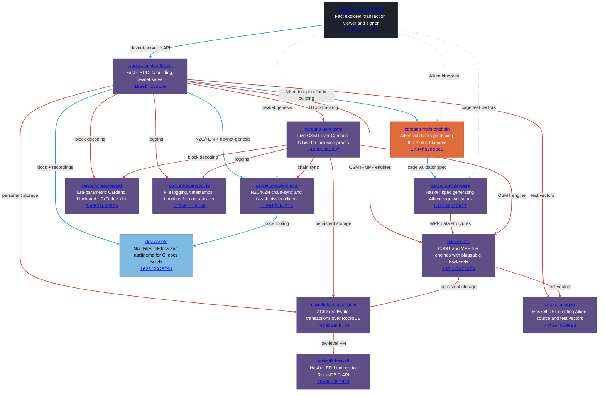

# MPFS Dependency Graph

Computed from the Nix flake closure of `cardano-mpfs-browser` + `cabal.project` `source-repository-package` entries at their locked revisions. Every edge is pinned to an exact commit hash and links to the source line where the dependency is declared.

## Repositories (nodes)

| # | Repo | Owner | Description |
|---|------|-------|-------------|
| 1 | [**cardano-mpfs-browser**](https://github.com/lambdasistemi/cardano-mpfs-browser/tree/8d2263e72f2d) | lambdasistemi | PureScript fact explorer, transaction viewer and signer |
| 2 | [**cardano-mpfs-offchain**](https://github.com/lambdasistemi/cardano-mpfs-offchain/tree/19eeb725dcbe) | lambdasistemi | Haskell off-chain service: fact CRUD, tx building, devnet server |
| 3 | [**cardano-mpfs-onchain**](https://github.com/cardano-foundation/cardano-mpfs-onchain/tree/2784fa9dc8e5) | cardano-foundation | Aiken on-chain validators for Merkle Patricia Forestry on Cardano |
| 4 | [**cardano-mpfs-cage**](https://github.com/cardano-foundation/cardano-mpfs-cage/tree/b1f133b22b27) | cardano-foundation | Language-agnostic MPFS cage validator specification |
| 5 | [**cardano-node-clients**](https://github.com/lambdasistemi/cardano-node-clients/tree/1104f7cb47fe) | lambdasistemi | Haskell clients for Cardano node mini-protocols (N2C + N2N) |
| 6 | [**cardano-utxo-csmt**](https://github.com/lambdasistemi/cardano-utxo-csmt/tree/3180863a280f) | lambdasistemi | HTTP service: Compact Sparse Merkle Tree over Cardano UTxO set |
| 7 | [**haskell-mts**](https://github.com/lambdasistemi/haskell-mts/tree/253ca2e7f073) | lambdasistemi | Merkle Tree Store: CSMT + MPF implementations with persistent storage |
| 8 | [**rocksdb-kv-transactions**](https://github.com/lambdasistemi/rocksdb-kv-transactions/tree/44c3c2a4b7ba) | lambdasistemi | RocksDB backend for key-value transactions |
| 9 | [**rocksdb-haskell**](https://github.com/lambdasistemi/rocksdb-haskell/tree/a3e86b39f951) | lambdasistemi | RocksDB Haskell FFI bindings (fork of jprupp) |
| 10 | [**cardano-read-ledger**](https://github.com/lambdasistemi/cardano-read-ledger/tree/2a9521e92824) | lambdasistemi | Read Cardano block data, parametrized by era |
| 11 | [**contra-tracer-contrib**](https://github.com/lambdasistemi/contra-tracer-contrib/tree/4f0c611e61b8) | lambdasistemi | Utility modules for contra-tracer: file logging, thread-safe wrappers, timestamps |
| 12 | [**aiken-codegen**](https://github.com/paolino/aiken-codegen/tree/74f364c10e93) | paolino | Haskell DSL for generating Aiken source code |
| 13 | [**dev-assets**](https://github.com/paolino/dev-assets/tree/1623f2925791) | paolino | Nix flake providing mkdocs + asciinema tooling for CI |

## Layer 1: Flake inputs (Nix closure)

These are direct flake inputs, locked in `flake.lock`. The browser's closure pins the entire tree.

### cardano-mpfs-browser (root)

| Input | Target | Source |
|-------|--------|--------|
| `cardano-mpfs-offchain` | cardano-mpfs-offchain `19eeb725dcbe` | [flake.nix:11](https://github.com/lambdasistemi/cardano-mpfs-browser/blob/8d2263e72f2d3ccfd277419f06668ec8ef744636/flake.nix#L11) |
| `cardano-mpfs-onchain` | follows `offchain/cardano-mpfs-onchain` | [flake.nix:14](https://github.com/lambdasistemi/cardano-mpfs-browser/blob/8d2263e72f2d3ccfd277419f06668ec8ef744636/flake.nix#L14) |
| `cardano-mpfs-cage` | follows `offchain/cardano-mpfs-cage` | [flake.nix:13](https://github.com/lambdasistemi/cardano-mpfs-browser/blob/8d2263e72f2d3ccfd277419f06668ec8ef744636/flake.nix#L13) |
| `cardano-node-clients` | follows `offchain/cardano-node-clients` | [flake.nix:15](https://github.com/lambdasistemi/cardano-mpfs-browser/blob/8d2263e72f2d3ccfd277419f06668ec8ef744636/flake.nix#L15) |
| `cardano-node` | follows `offchain/cardano-node` | [flake.nix:16](https://github.com/lambdasistemi/cardano-mpfs-browser/blob/8d2263e72f2d3ccfd277419f06668ec8ef744636/flake.nix#L16) |

### cardano-mpfs-offchain @ `19eeb725dcbe`

| Input | Target | Source |
|-------|--------|--------|
| `cardano-mpfs-onchain` | cardano-mpfs-onchain `2784fa9dc8e5` | [flake.nix:26](https://github.com/lambdasistemi/cardano-mpfs-offchain/blob/19eeb725dcbe1285e48d80aba522e5d85341c75f/flake.nix#L26) |
| `cardano-node-clients` | cardano-node-clients `1104f7cb47fe` | [flake.nix:23](https://github.com/lambdasistemi/cardano-mpfs-offchain/blob/19eeb725dcbe1285e48d80aba522e5d85341c75f/flake.nix#L23) |
| `mkdocs` | dev-assets `1623f2925791` | [flake.nix:12](https://github.com/lambdasistemi/cardano-mpfs-offchain/blob/19eeb725dcbe1285e48d80aba522e5d85341c75f/flake.nix#L12) |
| `asciinema` | dev-assets `1623f2925791` | [flake.nix:13](https://github.com/lambdasistemi/cardano-mpfs-offchain/blob/19eeb725dcbe1285e48d80aba522e5d85341c75f/flake.nix#L13) |

### cardano-mpfs-onchain @ `2784fa9dc8e5`

| Input | Target | Source |
|-------|--------|--------|
| `cardano-mpfs-cage` | cardano-mpfs-cage `b1f133b22b27` | [flake.nix:7](https://github.com/cardano-foundation/cardano-mpfs-onchain/blob/2784fa9dc8e523f7bc1cdc5c21ed4b57f23da4b8/flake.nix#L7) |

### cardano-node-clients @ `1104f7cb47fe`

| Input | Target | Source |
|-------|--------|--------|
| `mkdocs` | dev-assets `06b0878a5dc6` | [flake.nix:24](https://github.com/lambdasistemi/cardano-node-clients/blob/1104f7cb47fee3169074da1c803ff633b85c43f7/flake.nix#L24) |

## Layer 2: source-repository-package (cabal.project)

Haskell library dependencies, pinned by git tag + sha256. Each link goes to the `location:` line in the declaring `cabal.project`.

### cardano-mpfs-offchain @ `19eeb725dcbe`

| Dependency | Locked tag | Why | Source |
|------------|-----------|-----|--------|
| rocksdb-haskell | `a3e86b39f951` | FFI bindings for persistent storage | [cabal.project:22](https://github.com/lambdasistemi/cardano-mpfs-offchain/blob/19eeb725dcbe1285e48d80aba522e5d85341c75f/cabal.project#L22) |
| rocksdb-kv-transactions | `44c3c2a4b7ba` | ACID transactions over RocksDB | [cabal.project:28](https://github.com/lambdasistemi/cardano-mpfs-offchain/blob/19eeb725dcbe1285e48d80aba522e5d85341c75f/cabal.project#L28) |
| cardano-utxo-csmt | `3180863a280f` | UTxO Merkle tree tracking | [cabal.project:34](https://github.com/lambdasistemi/cardano-mpfs-offchain/blob/19eeb725dcbe1285e48d80aba522e5d85341c75f/cabal.project#L34) |
| haskell-mts | `253ca2e7f073` | CSMT + MPF Merkle engines | [cabal.project:40](https://github.com/lambdasistemi/cardano-mpfs-offchain/blob/19eeb725dcbe1285e48d80aba522e5d85341c75f/cabal.project#L40) |
| aiken-codegen | `74f364c10e93` | Generate Aiken source for test vectors | [cabal.project:46](https://github.com/lambdasistemi/cardano-mpfs-offchain/blob/19eeb725dcbe1285e48d80aba522e5d85341c75f/cabal.project#L46) |
| cardano-read-ledger | `2a9521e92824` | Era-parametric block decoding | [cabal.project:52](https://github.com/lambdasistemi/cardano-mpfs-offchain/blob/19eeb725dcbe1285e48d80aba522e5d85341c75f/cabal.project#L52) |
| contra-tracer-contrib | `4f0c611e61b8` | Structured logging | [cabal.project:58](https://github.com/lambdasistemi/cardano-mpfs-offchain/blob/19eeb725dcbe1285e48d80aba522e5d85341c75f/cabal.project#L58) |
| cardano-node-clients | `a965c5eee0af` | N2C/N2N mini-protocol clients | [cabal.project:64](https://github.com/lambdasistemi/cardano-mpfs-offchain/blob/19eeb725dcbe1285e48d80aba522e5d85341c75f/cabal.project#L64) |

### cardano-mpfs-cage @ `b1f133b22b27`

| Dependency | Locked tag | Why | Source |
|------------|-----------|-----|--------|
| haskell-mts | `4cd13f802cca` | MPF data structures for cage spec | [cabal.project:34](https://github.com/cardano-foundation/cardano-mpfs-cage/blob/b1f133b22b27ec1777dca769ce843b3f82e3bb55/cabal.project#L34) |
| rocksdb-haskell | `a3e86b39f951` | Transitive via mts | [cabal.project:22](https://github.com/cardano-foundation/cardano-mpfs-cage/blob/b1f133b22b27ec1777dca769ce843b3f82e3bb55/cabal.project#L22) |
| rocksdb-kv-transactions | `44c3c2a4b7ba` | Transitive via mts | [cabal.project:28](https://github.com/cardano-foundation/cardano-mpfs-cage/blob/b1f133b22b27ec1777dca769ce843b3f82e3bb55/cabal.project#L28) |

### cardano-utxo-csmt @ `3180863a280f`

| Dependency | Locked tag | Why | Source |
|------------|-----------|-----|--------|
| haskell-mts | `ce79d594ceb2` | CSMT engine for UTxO tracking | [cabal.project:28](https://github.com/lambdasistemi/cardano-utxo-csmt/blob/3180863a280f18675f4241742f7930240f40b0bd/cabal.project#L28) |
| rocksdb-haskell | `a3e86b39f951` | Persistent storage backend | [cabal.project:22](https://github.com/lambdasistemi/cardano-utxo-csmt/blob/3180863a280f18675f4241742f7930240f40b0bd/cabal.project#L22) |
| rocksdb-kv-transactions | `0888387a5de8` | ACID transactions | [cabal.project:34](https://github.com/lambdasistemi/cardano-utxo-csmt/blob/3180863a280f18675f4241742f7930240f40b0bd/cabal.project#L34) |
| cardano-read-ledger | `2a9521e92824` | Read UTxOs from chain | [cabal.project:40](https://github.com/lambdasistemi/cardano-utxo-csmt/blob/3180863a280f18675f4241742f7930240f40b0bd/cabal.project#L40) |
| contra-tracer-contrib | `4f0c611e61b8` | Structured logging | [cabal.project:46](https://github.com/lambdasistemi/cardano-utxo-csmt/blob/3180863a280f18675f4241742f7930240f40b0bd/cabal.project#L46) |
| cardano-node-clients | `a965c5eee0af` | Chain sync via mini-protocols | [cabal.project:52](https://github.com/lambdasistemi/cardano-utxo-csmt/blob/3180863a280f18675f4241742f7930240f40b0bd/cabal.project#L52) |

### haskell-mts @ `253ca2e7f073`

| Dependency | Locked tag | Why | Source |
|------------|-----------|-----|--------|
| rocksdb-haskell | `a3e86b39f951` | Persistent storage backend | [cabal.project:18](https://github.com/lambdasistemi/haskell-mts/blob/253ca2e7f0736c1740303162480d0fc9a77a9f68/cabal.project#L18) |
| rocksdb-kv-transactions | `0888387a5de8` | ACID transactions | [cabal.project:24](https://github.com/lambdasistemi/haskell-mts/blob/253ca2e7f0736c1740303162480d0fc9a77a9f68/cabal.project#L24) |
| aiken-codegen | `74f364c10e93` | Generate test vectors | [cabal.project:30](https://github.com/lambdasistemi/haskell-mts/blob/253ca2e7f0736c1740303162480d0fc9a77a9f68/cabal.project#L30) |

### rocksdb-kv-transactions @ `44c3c2a4b7ba`

| Dependency | Locked tag | Why | Source |
|------------|-----------|-----|--------|
| rocksdb-haskell | `a3e86b39f951` | Low-level FFI bindings | [cabal.project:5](https://github.com/lambdasistemi/rocksdb-kv-transactions/blob/44c3c2a4b7bab8ca0ca444c99977a358fc6af0ae/cabal.project#L5) |

## Mermaid diagram

**Legend**

| | |
|---|---|
| **Nodes** | |
|  Purple | Haskell |
|  Orange | Aiken |
|  Dark | PureScript |
|  Blue | Nix |
| **Edges** | |
|  Blue solid ──> | Flake input (declared in `flake.nix`) |
|  Light blue dashed --.-> | Flake follows (delegated to another input) |
|  Red thick ==> | Cabal `source-repository-package` |

## Summary

**13 repositories** form the MPFS stack. The graph answers "why do we manage each one":

- **rocksdb-haskell** — we forked jprupp's bindings; everything persistent ultimately depends on this FFI layer
- **rocksdb-kv-transactions** — adds ACID semantics on top of raw RocksDB; used by every service that stores Merkle trees
- **haskell-mts** — the Merkle Tree Store: implements both CSMT and MPF data structures with pluggable persistent backends; the core engine
- **aiken-codegen** — Haskell DSL that generates Aiken source; needed so the cage spec and MTS can produce test vectors and validators programmatically
- **cardano-mpfs-cage** — language-agnostic validator specification (Cardano Foundation); defines the on-chain rules as a Haskell spec that generates Aiken
- **cardano-mpfs-onchain** — the actual Aiken validators compiled from the cage spec; produces the Plutus blueprint consumed by off-chain tx building
- **contra-tracer-contrib** — structured logging utilities (timestamps, throttling, file output); operational observability for services
- **cardano-read-ledger** — era-parametric Cardano block decoder; both the UTxO CSMT and off-chain service need to read chain data without era-specific code
- **cardano-node-clients** — N2C/N2N mini-protocol Haskell clients + devnet genesis generation; the transport layer to talk to cardano-node
- **cardano-utxo-csmt** — HTTP service maintaining a live CSMT over Cardano's UTxO set; provides inclusion proofs the off-chain service needs for fact verification
- **cardano-mpfs-offchain** — the main Haskell service: fact CRUD, transaction building, devnet server; integrates everything above
- **cardano-mpfs-browser** — PureScript UI for exploring facts, viewing/signing transactions; the user-facing entry point
- **dev-assets** — Nix flake providing mkdocs and asciinema for CI documentation builds across multiple repos
