# Dependency Graph

Computed from the Nix flake closure + `cabal.project` `source-repository-package` entries at locked revisions. Every edge is pinned to an exact commit hash.

## Repositories

| Repo | Owner | Description |
|------|-------|-------------|
| [**cardano-mpfs-browser**](https://github.com/lambdasistemi/cardano-mpfs-browser/tree/b1015bde27f2) | lambdasistemi | MPFS Explorer — fact explorer and transaction verifier |
| [**cardano-mpfs-cage**](https://github.com/cardano-foundation/cardano-mpfs-cage/tree/b1f133b22b27) | cardano-foundation | Language-agnostic MPFS cage validator specification |
| [**cardano-mpfs-offchain**](https://github.com/lambdasistemi/cardano-mpfs-offchain/tree/19eeb725dcbe) | lambdasistemi | (no description) |
| [**cardano-node-clients**](https://github.com/lambdasistemi/cardano-node-clients/tree/1104f7cb47fe) | lambdasistemi | Haskell clients for Cardano node mini-protocols (N2C + N2N) |
| [**cardano-read-ledger**](https://github.com/lambdasistemi/cardano-read-ledger/tree/2a9521e9282e) | lambdasistemi | Read Cardano block data, parametrized by era |
| [**cardano-utxo-csmt**](https://github.com/lambdasistemi/cardano-utxo-csmt/tree/3180863a280f) | lambdasistemi | HTTP service maintaining a Compact Sparse Merkle Tree over Cardano's UTxO set for efficient inclusion proofs |
| [**contra-tracer-contrib**](https://github.com/lambdasistemi/contra-tracer-contrib/tree/4f0c611e61b8) | lambdasistemi | Utility modules for contra-tracer: file logging, thread-safe wrappers, timestamps, throttling, and more |
| [**haskell-mts**](https://github.com/lambdasistemi/haskell-mts/tree/253ca2e7f073) | lambdasistemi | Compact Sparse Merkle Tree implementation in Haskell with persistent storage and Merkle proofs |
| [**rocksdb-haskell**](https://github.com/lambdasistemi/rocksdb-haskell/tree/a3e86b39f951) | lambdasistemi | RocksDB Haskell Bindings |
| [**rocksdb-kv-transactions**](https://github.com/lambdasistemi/rocksdb-kv-transactions/tree/44c3c2a4b7ba) | lambdasistemi | RocksDB backend for key-value transactions |
| [**aiken-codegen**](https://github.com/paolino/aiken-codegen/tree/74f364c10e93) | paolino | Haskell DSL for generating Aiken source code |
| [**cardano-mpfs-onchain**](https://github.com/paolino/cardano-mpfs-onchain/tree/2784fa9dc8e5) | paolino | Aiken on-chain validators for Merkle Patricia Forestry on Cardano |
| [**dev-assets**](https://github.com/paolino/dev-assets/tree/1623f2925791) | paolino | Actions for haskell, nix and mkdocs workflows |
| [**sparse-merkle-trees**](https://github.com/paolino/sparse-merkle-trees/tree/082280d772a9) | paolino | Sparse Merkle trees with proofs of inclusion and exclusion |

## Flake inputs

### cardano-mpfs-browser (root)

| Input | Target | Type | Source |
|-------|--------|------|--------|
| `cardano-mpfs-cage` | cardano-foundation/cardano-mpfs-cage `b1f133b22b27` | follows | [flake.nix](https://github.com/lambdasistemi/cardano-mpfs-browser/blob/b1015bde27f2/flake.nix) |
| `cardano-mpfs-offchain` | lambdasistemi/cardano-mpfs-offchain `19eeb725dcbe` | flake | [flake.nix](https://github.com/lambdasistemi/cardano-mpfs-browser/blob/b1015bde27f2/flake.nix) |
| `cardano-node-clients` | lambdasistemi/cardano-node-clients `1104f7cb47fe` | follows | [flake.nix](https://github.com/lambdasistemi/cardano-mpfs-browser/blob/b1015bde27f2/flake.nix) |
| `cardano-mpfs-onchain` | paolino/cardano-mpfs-onchain `2784fa9dc8e5` | follows | [flake.nix](https://github.com/lambdasistemi/cardano-mpfs-browser/blob/b1015bde27f2/flake.nix) |

### lambdasistemi/cardano-mpfs-offchain @ `19eeb725dcbe`

| Input | Target | Type | Source |
|-------|--------|------|--------|
| `cardano-mpfs-cage` | cardano-foundation/cardano-mpfs-cage `b1f133b22b27` | follows | [flake.nix](https://github.com/lambdasistemi/cardano-mpfs-offchain/blob/19eeb725dcbe/flake.nix) |
| `cardano-node-clients` | lambdasistemi/cardano-node-clients `1104f7cb47fe` | flake | [flake.nix](https://github.com/lambdasistemi/cardano-mpfs-offchain/blob/19eeb725dcbe/flake.nix) |
| `cardano-mpfs-onchain` | paolino/cardano-mpfs-onchain `2784fa9dc8e5` | flake | [flake.nix](https://github.com/lambdasistemi/cardano-mpfs-offchain/blob/19eeb725dcbe/flake.nix) |
| `mkdocs` | paolino/dev-assets `1623f2925791` | flake | [flake.nix](https://github.com/lambdasistemi/cardano-mpfs-offchain/blob/19eeb725dcbe/flake.nix) |
| `asciinema` | paolino/dev-assets `1623f2925791` | flake | [flake.nix](https://github.com/lambdasistemi/cardano-mpfs-offchain/blob/19eeb725dcbe/flake.nix) |

### lambdasistemi/cardano-node-clients @ `1104f7cb47fe`

| Input | Target | Type | Source |
|-------|--------|------|--------|
| `mkdocs` | paolino/dev-assets `06b0878a5dc6` | flake | [flake.nix](https://github.com/lambdasistemi/cardano-node-clients/blob/1104f7cb47fe/flake.nix) |

### paolino/cardano-mpfs-onchain @ `2784fa9dc8e5`

| Input | Target | Type | Source |
|-------|--------|------|--------|
| `cardano-mpfs-cage` | cardano-foundation/cardano-mpfs-cage `b1f133b22b27` | flake | [flake.nix](https://github.com/paolino/cardano-mpfs-onchain/blob/2784fa9dc8e5/flake.nix) |

## Cabal source-repository-package

### cardano-foundation/cardano-mpfs-cage @ `b1f133b22b27`

| Dependency | Locked tag | Source |
|------------|-----------|--------|
| paolino/haskell-mts | `4cd13f802cca` | [cabal.project:34](https://github.com/cardano-foundation/cardano-mpfs-cage/blob/b1f133b22b27/cabal.project#L34) |
| paolino/rocksdb-haskell | `a3e86b39f951` | [cabal.project:22](https://github.com/cardano-foundation/cardano-mpfs-cage/blob/b1f133b22b27/cabal.project#L22) |
| paolino/rocksdb-kv-transactions | `44c3c2a4b7ba` | [cabal.project:28](https://github.com/cardano-foundation/cardano-mpfs-cage/blob/b1f133b22b27/cabal.project#L28) |

### lambdasistemi/cardano-mpfs-offchain @ `19eeb725dcbe`

| Dependency | Locked tag | Source |
|------------|-----------|--------|
| lambdasistemi/cardano-node-clients | `a965c5eee0af` | [cabal.project:64](https://github.com/lambdasistemi/cardano-mpfs-offchain/blob/19eeb725dcbe/cabal.project#L64) |
| lambdasistemi/cardano-read-ledger | `2a9521e9282e` | [cabal.project:52](https://github.com/lambdasistemi/cardano-mpfs-offchain/blob/19eeb725dcbe/cabal.project#L52) |
| lambdasistemi/cardano-utxo-csmt | `3180863a280f` | [cabal.project:34](https://github.com/lambdasistemi/cardano-mpfs-offchain/blob/19eeb725dcbe/cabal.project#L34) |
| lambdasistemi/contra-tracer-contrib | `4f0c611e61b8` | [cabal.project:58](https://github.com/lambdasistemi/cardano-mpfs-offchain/blob/19eeb725dcbe/cabal.project#L58) |
| lambdasistemi/haskell-mts | `253ca2e7f073` | [cabal.project:40](https://github.com/lambdasistemi/cardano-mpfs-offchain/blob/19eeb725dcbe/cabal.project#L40) |
| lambdasistemi/rocksdb-haskell | `a3e86b39f951` | [cabal.project:22](https://github.com/lambdasistemi/cardano-mpfs-offchain/blob/19eeb725dcbe/cabal.project#L22) |
| lambdasistemi/rocksdb-kv-transactions | `44c3c2a4b7ba` | [cabal.project:28](https://github.com/lambdasistemi/cardano-mpfs-offchain/blob/19eeb725dcbe/cabal.project#L28) |
| paolino/aiken-codegen | `74f364c10e93` | [cabal.project:46](https://github.com/lambdasistemi/cardano-mpfs-offchain/blob/19eeb725dcbe/cabal.project#L46) |

### lambdasistemi/cardano-utxo-csmt @ `3180863a280f`

| Dependency | Locked tag | Source |
|------------|-----------|--------|
| lambdasistemi/cardano-node-clients | `a965c5eee0af` | [cabal.project:52](https://github.com/lambdasistemi/cardano-utxo-csmt/blob/3180863a280f/cabal.project#L52) |
| lambdasistemi/cardano-read-ledger | `2a9521e9282e` | [cabal.project:40](https://github.com/lambdasistemi/cardano-utxo-csmt/blob/3180863a280f/cabal.project#L40) |
| lambdasistemi/contra-tracer-contrib | `4f0c611e61b8` | [cabal.project:46](https://github.com/lambdasistemi/cardano-utxo-csmt/blob/3180863a280f/cabal.project#L46) |
| lambdasistemi/haskell-mts | `ce79d594ceb2` | [cabal.project:28](https://github.com/lambdasistemi/cardano-utxo-csmt/blob/3180863a280f/cabal.project#L28) |
| lambdasistemi/rocksdb-haskell | `a3e86b39f951` | [cabal.project:22](https://github.com/lambdasistemi/cardano-utxo-csmt/blob/3180863a280f/cabal.project#L22) |
| lambdasistemi/rocksdb-kv-transactions | `0888387a5de8` | [cabal.project:34](https://github.com/lambdasistemi/cardano-utxo-csmt/blob/3180863a280f/cabal.project#L34) |

### lambdasistemi/haskell-mts @ `253ca2e7f073`

| Dependency | Locked tag | Source |
|------------|-----------|--------|
| paolino/aiken-codegen | `74f364c10e93` | [cabal.project:30](https://github.com/lambdasistemi/haskell-mts/blob/253ca2e7f073/cabal.project#L30) |
| paolino/rocksdb-haskell | `a3e86b39f951` | [cabal.project:18](https://github.com/lambdasistemi/haskell-mts/blob/ce79d594ceb2/cabal.project#L18) |
| paolino/rocksdb-haskell | `a3e86b39f951` | [cabal.project:18](https://github.com/lambdasistemi/haskell-mts/blob/253ca2e7f073/cabal.project#L18) |
| paolino/rocksdb-kv-transactions | `0888387a5de8` | [cabal.project:24](https://github.com/lambdasistemi/haskell-mts/blob/ce79d594ceb2/cabal.project#L24) |
| paolino/rocksdb-kv-transactions | `0888387a5de8` | [cabal.project:24](https://github.com/lambdasistemi/haskell-mts/blob/253ca2e7f073/cabal.project#L24) |
| paolino/sparse-merkle-trees | `082280d772a9` | [cabal.project:12](https://github.com/lambdasistemi/haskell-mts/blob/ce79d594ceb2/cabal.project#L12) |
| paolino/sparse-merkle-trees | `082280d772a9` | [cabal.project:12](https://github.com/lambdasistemi/haskell-mts/blob/253ca2e7f073/cabal.project#L12) |

### lambdasistemi/rocksdb-kv-transactions @ `44c3c2a4b7ba`

| Dependency | Locked tag | Source |
|------------|-----------|--------|
| paolino/rocksdb-haskell | `a3e86b39f951` | [cabal.project:5](https://github.com/lambdasistemi/rocksdb-kv-transactions/blob/44c3c2a4b7ba/cabal.project#L5) |
| paolino/rocksdb-haskell | `a3e86b39f951` | [cabal.project:5](https://github.com/lambdasistemi/rocksdb-kv-transactions/blob/0888387a5de8/cabal.project#L5) |

### paolino/haskell-mts @ `4cd13f802cca`

| Dependency | Locked tag | Source |
|------------|-----------|--------|
| paolino/rocksdb-haskell | `a3e86b39f951` | [cabal.project:18](https://github.com/paolino/haskell-mts/blob/4cd13f802cca/cabal.project#L18) |
| paolino/rocksdb-kv-transactions | `0888387a5de8` | [cabal.project:24](https://github.com/paolino/haskell-mts/blob/4cd13f802cca/cabal.project#L24) |
| paolino/sparse-merkle-trees | `082280d772a9` | [cabal.project:12](https://github.com/paolino/haskell-mts/blob/4cd13f802cca/cabal.project#L12) |

### paolino/rocksdb-kv-transactions @ `44c3c2a4b7ba`

| Dependency | Locked tag | Source |
|------------|-----------|--------|
| paolino/rocksdb-haskell | `a3e86b39f951` | [cabal.project:5](https://github.com/paolino/rocksdb-kv-transactions/blob/44c3c2a4b7ba/cabal.project#L5) |
| paolino/rocksdb-haskell | `a3e86b39f951` | [cabal.project:5](https://github.com/paolino/rocksdb-kv-transactions/blob/0888387a5de8/cabal.project#L5) |

## Diagram

```mermaid
graph TD
    classDef haskell fill:#5e5086,stroke:#3d3364,color:#fff
    classDef aiken fill:#e06c3c,stroke:#b34a24,color:#fff
    classDef purescript fill:#1d222d,stroke:#14181f,color:#fff
    classDef nix fill:#7ebae4,stroke:#5a8ab0,color:#000

    cardano_mpfs_browser["<a href='https://github.com/lambdasistemi/cardano-mpfs-browser/tree/b1015bde27f2'>cardano-mpfs-browser</a><br/>MPFS Explorer — fact explorer and transaction verifier<br/><a href='https://github.com/lambdasistemi/cardano-mpfs-browser/commit/b1015bde27f2'><code>b1015bde27f2</code></a>"]:::purescript
    cardano_mpfs_cage["<a href='https://github.com/cardano-foundation/cardano-mpfs-cage/tree/b1f133b22b27'>cardano-mpfs-cage</a><br/>Language-agnostic MPFS cage validator specification<br/><a href='https://github.com/cardano-foundation/cardano-mpfs-cage/commit/b1f133b22b27'><code>b1f133b22b27</code></a>"]:::haskell
    cardano_mpfs_offchain["<a href='https://github.com/lambdasistemi/cardano-mpfs-offchain/tree/19eeb725dcbe'>cardano-mpfs-offchain</a><br/>(no description)<br/><a href='https://github.com/lambdasistemi/cardano-mpfs-offchain/commit/19eeb725dcbe'><code>19eeb725dcbe</code></a>"]:::haskell
    cardano_node_clients["<a href='https://github.com/lambdasistemi/cardano-node-clients/tree/1104f7cb47fe'>cardano-node-clients</a><br/>Haskell clients for Cardano node mini-protocols (N2C + N2N)<br/><a href='https://github.com/lambdasistemi/cardano-node-clients/commit/1104f7cb47fe'><code>1104f7cb47fe</code></a>"]:::haskell
    cardano_read_ledger["<a href='https://github.com/lambdasistemi/cardano-read-ledger/tree/2a9521e9282e'>cardano-read-ledger</a><br/>Read Cardano block data, parametrized by era<br/><a href='https://github.com/lambdasistemi/cardano-read-ledger/commit/2a9521e9282e'><code>2a9521e9282e</code></a>"]:::haskell
    cardano_utxo_csmt["<a href='https://github.com/lambdasistemi/cardano-utxo-csmt/tree/3180863a280f'>cardano-utxo-csmt</a><br/>HTTP service maintaining a Compact Sparse Merkle Tree over Cardano's UTxO set for efficient inclusion proofs<br/><a href='https://github.com/lambdasistemi/cardano-utxo-csmt/commit/3180863a280f'><code>3180863a280f</code></a>"]:::haskell
    contra_tracer_contrib["<a href='https://github.com/lambdasistemi/contra-tracer-contrib/tree/4f0c611e61b8'>contra-tracer-contrib</a><br/>Utility modules for contra-tracer: file logging, thread-safe wrappers, timestamps, throttling, and more<br/><a href='https://github.com/lambdasistemi/contra-tracer-contrib/commit/4f0c611e61b8'><code>4f0c611e61b8</code></a>"]:::haskell
    haskell_mts["<a href='https://github.com/lambdasistemi/haskell-mts/tree/253ca2e7f073'>haskell-mts</a><br/>Compact Sparse Merkle Tree implementation in Haskell with persistent storage and Merkle proofs<br/><a href='https://github.com/lambdasistemi/haskell-mts/commit/253ca2e7f073'><code>253ca2e7f073</code></a>"]:::haskell
    rocksdb_haskell["<a href='https://github.com/lambdasistemi/rocksdb-haskell/tree/a3e86b39f951'>rocksdb-haskell</a><br/>RocksDB Haskell Bindings<br/><a href='https://github.com/lambdasistemi/rocksdb-haskell/commit/a3e86b39f951'><code>a3e86b39f951</code></a>"]:::haskell
    rocksdb_kv_transactions["<a href='https://github.com/lambdasistemi/rocksdb-kv-transactions/tree/44c3c2a4b7ba'>rocksdb-kv-transactions</a><br/>RocksDB backend for key-value transactions<br/><a href='https://github.com/lambdasistemi/rocksdb-kv-transactions/commit/44c3c2a4b7ba'><code>44c3c2a4b7ba</code></a>"]:::haskell
    aiken_codegen["<a href='https://github.com/paolino/aiken-codegen/tree/74f364c10e93'>aiken-codegen</a><br/>Haskell DSL for generating Aiken source code<br/><a href='https://github.com/paolino/aiken-codegen/commit/74f364c10e93'><code>74f364c10e93</code></a>"]:::haskell
    cardano_mpfs_onchain["<a href='https://github.com/paolino/cardano-mpfs-onchain/tree/2784fa9dc8e5'>cardano-mpfs-onchain</a><br/>Aiken on-chain validators for Merkle Patricia Forestry on Cardano<br/><a href='https://github.com/paolino/cardano-mpfs-onchain/commit/2784fa9dc8e5'><code>2784fa9dc8e5</code></a>"]:::aiken
    dev_assets["<a href='https://github.com/paolino/dev-assets/tree/1623f2925791'>dev-assets</a><br/>Actions for haskell, nix and mkdocs workflows<br/><a href='https://github.com/paolino/dev-assets/commit/1623f2925791'><code>1623f2925791</code></a>"]:::nix
    sparse_merkle_trees["<a href='https://github.com/paolino/sparse-merkle-trees/tree/082280d772a9'>sparse-merkle-trees</a><br/>Sparse Merkle trees with proofs of inclusion and exclusion<br/><a href='https://github.com/paolino/sparse-merkle-trees/commit/082280d772a9'><code>082280d772a9</code></a>"]:::haskell

    cardano_mpfs_offchain -.->|"cardano-mpfs-cage"| cardano_mpfs_cage
    cardano_mpfs_offchain -->|"cardano-node-clients"| cardano_node_clients
    cardano_mpfs_offchain -->|"cardano-mpfs-onchain"| cardano_mpfs_onchain
    cardano_mpfs_offchain -->|"mkdocs"| dev_assets
    cardano_mpfs_offchain -->|"asciinema"| dev_assets
    cardano_node_clients -->|"mkdocs"| dev_assets
    cardano_mpfs_onchain -->|"cardano-mpfs-cage"| cardano_mpfs_cage
    cardano_mpfs_browser -.->|"cardano-mpfs-cage"| cardano_mpfs_cage
    cardano_mpfs_browser -->|"cardano-mpfs-offchain"| cardano_mpfs_offchain
    cardano_mpfs_browser -.->|"cardano-node-clients"| cardano_node_clients
    cardano_mpfs_browser -.->|"cardano-mpfs-onchain"| cardano_mpfs_onchain
    cardano_mpfs_cage ==>|"cabal"| haskell_mts
    cardano_mpfs_cage ==>|"cabal"| rocksdb_haskell
    cardano_mpfs_cage ==>|"cabal"| rocksdb_kv_transactions
    cardano_mpfs_offchain ==>|"cabal"| cardano_node_clients
    cardano_mpfs_offchain ==>|"cabal"| cardano_read_ledger
    cardano_mpfs_offchain ==>|"cabal"| cardano_utxo_csmt
    cardano_mpfs_offchain ==>|"cabal"| contra_tracer_contrib
    cardano_mpfs_offchain ==>|"cabal"| haskell_mts
    cardano_mpfs_offchain ==>|"cabal"| rocksdb_haskell
    cardano_mpfs_offchain ==>|"cabal"| rocksdb_kv_transactions
    cardano_mpfs_offchain ==>|"cabal"| aiken_codegen
    cardano_utxo_csmt ==>|"cabal"| cardano_node_clients
    cardano_utxo_csmt ==>|"cabal"| cardano_read_ledger
    cardano_utxo_csmt ==>|"cabal"| contra_tracer_contrib
    cardano_utxo_csmt ==>|"cabal"| haskell_mts
    cardano_utxo_csmt ==>|"cabal"| rocksdb_haskell
    cardano_utxo_csmt ==>|"cabal"| rocksdb_kv_transactions
    haskell_mts ==>|"cabal"| aiken_codegen
    haskell_mts ==>|"cabal"| rocksdb_haskell
    haskell_mts ==>|"cabal"| rocksdb_kv_transactions
    haskell_mts ==>|"cabal"| sparse_merkle_trees
    rocksdb_kv_transactions ==>|"cabal"| rocksdb_haskell

    linkStyle 1,2,3,4,5,6,8 stroke:#2196F3,stroke-width:2px
    linkStyle 0,7,9,10 stroke:#90CAF9,stroke-width:1px
    linkStyle 11,12,13,14,15,16,17,18,19,20,21,22,23,24,25,26,27,28,29,30,31,32 stroke:#e53935,stroke-width:2px
```

**Legend**

| | |
|---|---|
| **Nodes** | |
|  Purple | Haskell |
|  Orange | Aiken |
|  Dark | PureScript |
|  Blue | Nix |
| **Edges** | |
|  Blue solid ──> | Flake input (declared in `flake.nix`) |
|  Light blue dashed --.-> | Flake follows (delegated to another input) |
|  Red thick ==> | Cabal `source-repository-package` |
