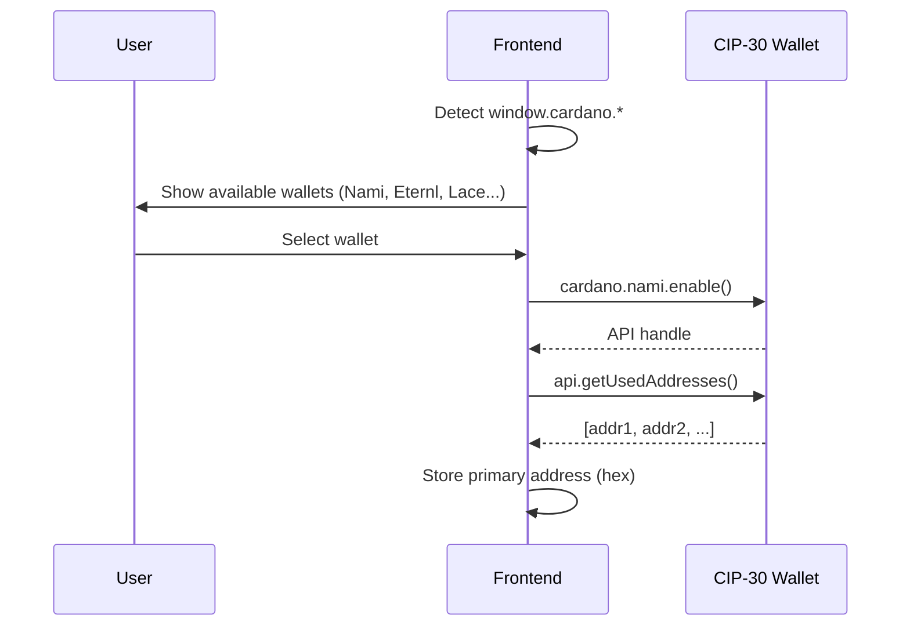
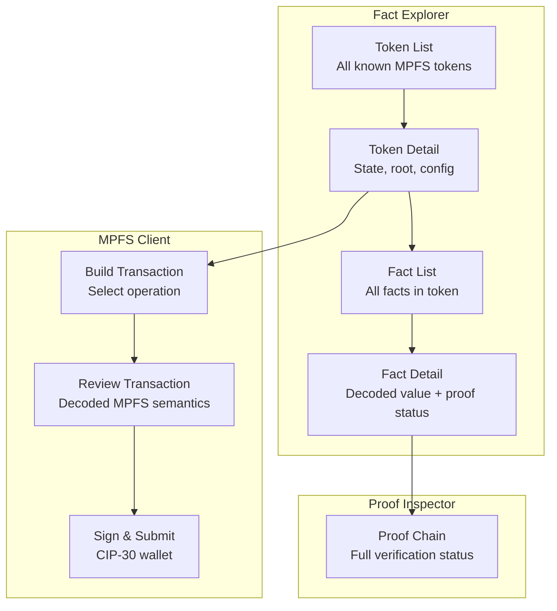
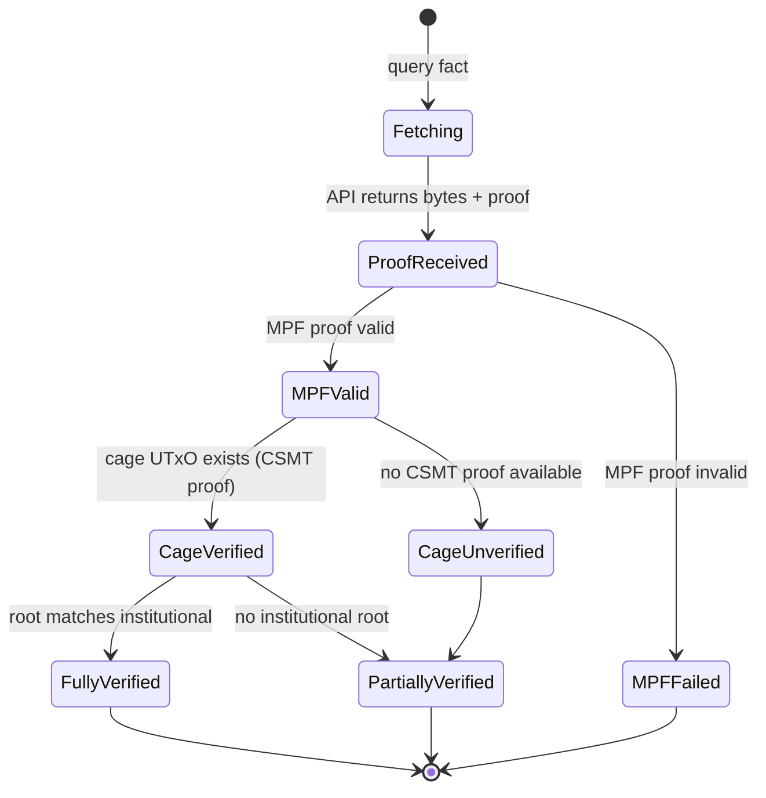

# Architecture

## CIP-30 Wallet Integration

### Connection Flow



### API Surface Used

| CIP-30 Method | Purpose |
|---------------|---------|
| `cardano.<wallet>.enable()` | Connect to wallet |
| `api.getUsedAddresses()` | Get user's address for tx building |
| `api.signTx(tx, partialSign)` | Sign unsigned transaction |
| `api.getNetworkId()` | Verify correct network (mainnet/testnet) |

The frontend does **not** use `api.submitTx()` — submission goes
through the MPFS API which handles chain submission via its node
connection.

## State Persistence

The entire application state is serialized to localStorage. If the
browser tab closes — accidentally or intentionally — reopening
restores the exact same view: same token, same fact, same pending
transaction, same wallet connection.

### What Lives Where

| Storage | Content | Purpose |
|---------|---------|---------|
| URL hash | Navigation: token, fact key, current page | Bookmarkable, shareable |
| localStorage | Session config: API URL, root source, connected wallet, verified schemas, view state | Survives tab close |

### URL Structure

```
#/token/abc123                    → token detail
#/token/abc123/facts              → fact list
#/token/abc123/facts/mykey        → fact detail + proof
#/token/abc123/tx/insert          → build insert tx
```

### Recovery Guarantee

The app serializes its full state to localStorage on every state
change. On load, it reads localStorage first, then the URL hash.
The result: Ctrl+W → reopen → identical view. No re-entry of API
URL, no wallet reconnection prompt, no lost context.

This is critical for the trust boundary role: the user must
always be able to see where they are in a verification or
signing flow, even after an interruption.

## Application Structure

### Pages



### Token List View

Shows all MPFS tokens the API tracks:

- Token ID (asset name, hex + decoded if UTF-8)
- Owner (payment key hash → bech32 if possible)
- Current root (truncated hash)
- Pending requests count
- Phase indicator (process/retract window)

### Fact Detail View

For a single fact:

- **Key** — raw hex + schema-decoded rendering
- **Value** — raw hex + schema-decoded rendering
- **Proof status**:
    - ✓ MPF proof valid against cage root
    - ✓ Cage UTxO exists (CSMT proof valid)
    - ✓ CSMT root matches institutional publisher
    - Or: ⚠ partial verification (e.g. no institutional root
      configured)

### Proof Inspector

Expandable panel showing the full verification chain:

- Institutional root source and value
- CSMT proof steps (Merkle path)
- Cage UTxO details (TxIn, datum, value)
- MPF proof steps (trie path)
- Final verdict: fully verified / partially verified / unverified

### Fact Verification State Machine

Each fact goes through a verification pipeline. The UI reflects
the current state with visual indicators:



| State | UI Indicator | Meaning |
|-------|-------------|---------|
| Fetching | Spinner | Awaiting API response |
| MPF Failed | Red | Fact proof invalid — data cannot be trusted |
| Partially Verified | Yellow | Fact is in trie, but chain anchor incomplete |
| Fully Verified | Green | Complete proof chain from fact to institutional root |

## API Dependency

The frontend consumes the MPFS off-chain HTTP API. Current endpoint
status:

### Available (PR #108)

| Endpoint | Purpose |
|----------|---------|
| `GET /status` | Service health and sync status |
| `GET /tokens` | List all tracked tokens |
| `GET /tokens/:id` | Token state (owner, root, config) |
| `GET /tokens/:id/root` | Current trie root |
| `GET /tokens/:id/facts/:key` | Fact value + MPF proof |
| `GET /tokens/:id/proofs/:key` | MPF proof only |
| `GET /tokens/:id/requests` | Pending requests |
| `POST /tx/boot` | Build boot transaction |
| `POST /tx/request/insert` | Build insert request tx |
| `POST /tx/request/delete` | Build delete request tx |
| `POST /tx/update` | Build update tx |
| `POST /tx/retract` | Build retract tx |
| `POST /tx/end` | Build end tx |
| `POST /tx/submit` | Submit signed tx |

### Needed (issue #117)

| Endpoint | Purpose |
|----------|---------|
| `GET /utxo/:txin` | Resolve TxIn to full UTxO |
| `GET /utxo/:txin/proof` | CSMT inclusion proof |
| `GET /csmt/root` | Current UTXO Merkle root |

## Technology Stack

- **PureScript** with Halogen (component framework)
- **Nix flake** for reproducible dev environment
- **esbuild** for bundling (via spago)
- **MkDocs** with Material theme for documentation
- **No backend** — static SPA served from GitHub Pages or
  alongside the MPFS API

## Open Questions

1. **Schema format** — JSON Schema + extensions? Custom minimal
   format? CIP-100 alignment?
2. **CBOR decoding in PureScript** — which library? FFI to a JS
   CBOR library? How much of the Cardano tx structure do we need
   to parse?
3. **Institutional root protocol** — is there a standard for
   publishing UTXO Merkle roots, or do we define one?
4. **Multi-token view** — should the explorer support comparing
   facts across tokens, or is it strictly per-token?
5. **Schema registry** — could schemas themselves be an MPFS token,
   creating a self-referential schema registry?
