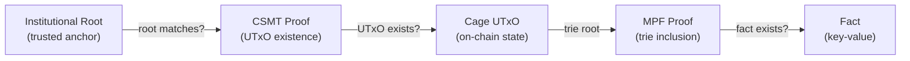
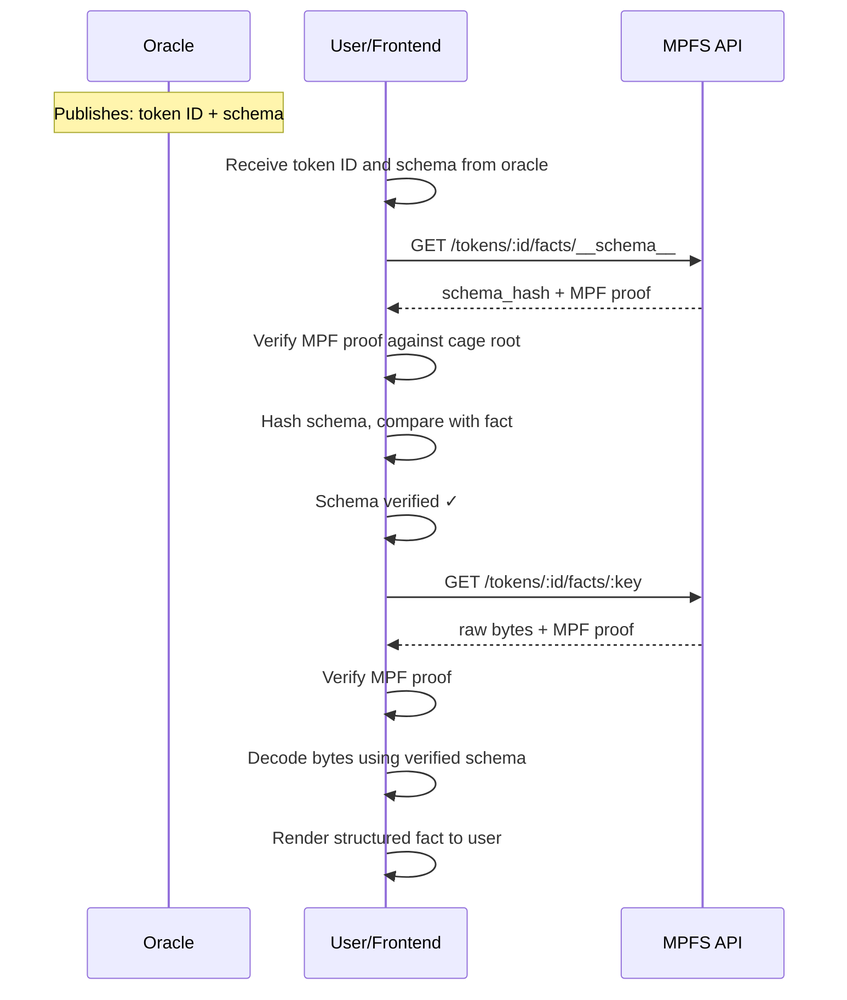
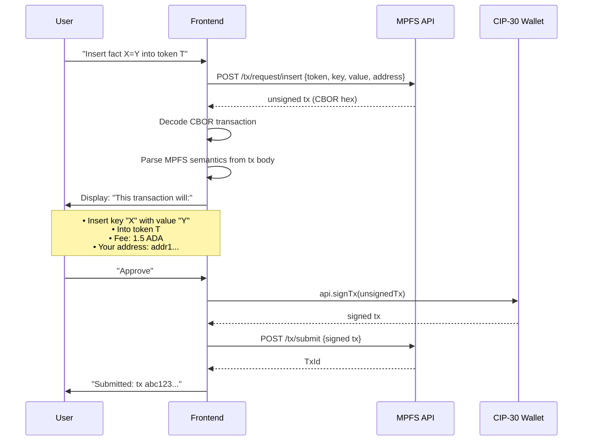
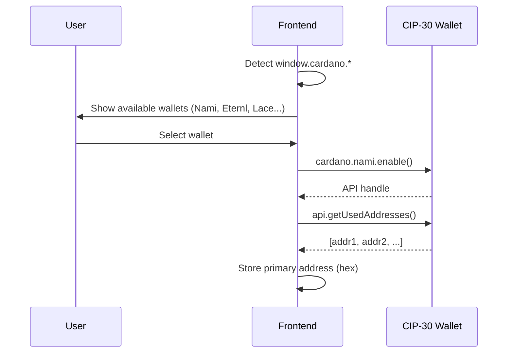
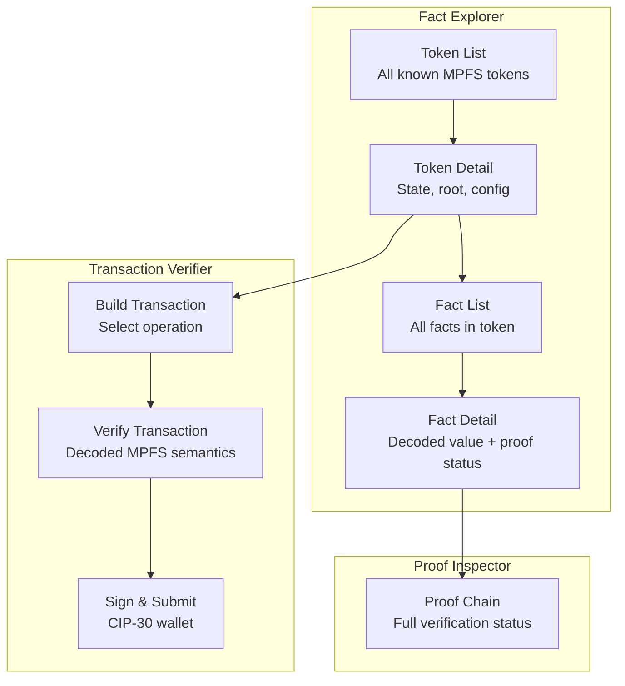

# Design

## Overview

MPFS Explorer is a PureScript single-page application that serves
two purposes:

1. **Fact Explorer** — given an MPFS token, query its facts and
   render them using a verified schema
2. **Transaction Verifier** — decode unsigned MPFS transactions,
   display their semantics, and delegate signing to a CIP-30 wallet

The fundamental design principle is **zero trust in the off-chain
service**. Every piece of data the frontend receives is independently
verified via Merkle proofs before being presented to the user.

## Trust Model

### What the User Needs

To use the application, a user provides exactly three inputs:

1. **Token ID** — published by the oracle (token owner) alongside
   the schema. The oracle is responsible for making this public.
2. **MPFS API URL** — the address of any MPFS off-chain service.
   This is **untrusted** — it is just a data pipe.
3. **Institutional UTXO Merkle root source** — a trusted party
   (e.g. Cardano Foundation) that publishes the current UTXO
   Merkle tree root.

Everything else is provable. The MPFS service is **obligated** to
provide proofs for anything it claims — if it lies or withholds
data, the proofs won't verify and the user knows immediately.

### The Oracle's Responsibility

The oracle (token owner) publishes:

- The **token ID** — identifies the cage on-chain
- The **schema** — describes how to interpret facts
- The **schema hash** is stored as a fact in the trie itself

By publishing the token ID, the oracle gives users the entry
point to independently verify everything: the cage UTxO, the
trie root, the schema hash, and every fact.

### The Verification Chain

The application verifies facts through a four-layer chain, where
each layer is independently provable:

| Layer | What it proves | Trust source |
|-------|---------------|--------------|
| Institutional Root | The UTXO Merkle root is authentic | Published by a known party (e.g. Cardano Foundation) |
| CSMT Proof | The cage UTxO exists in the UTXO set | Verified against institutional root |
| Cage UTxO | The cage's current trie root | Proved to exist on-chain |
| MPF Proof | A fact exists in the cage's trie | Verified against cage's trie root |

**No Cardano node is required.** The entire chain is verified
client-side using cryptographic proofs and a single trusted root.

### What the User Trusts

- The oracle's published token ID (explicit, public)
- The institutional root publisher (explicit, auditable)
- The browser (runs the verification code)
- **Nothing else** — not the MPFS off-chain service, not the API

### The MPFS Service Obligation

The off-chain service is untrusted but has a clear contract: for
any data it holds that is committed to the Merkle tree, it
**must** provide the corresponding proof. The user can always
verify:

- Is this fact actually in the trie? (MPF proof)
- Does this trie root match what's on-chain? (cage UTxO)
- Does this cage UTxO actually exist? (CSMT proof)
- Is the UTXO set root authentic? (institutional root)

If any link breaks, the user sees it. The service cannot
selectively lie — it either provides valid proofs or the
verification fails visibly.

## Schema-Driven Fact Rendering

### The Problem

MPFS stores facts as raw bytestrings. In real applications these
will be structured data (JSON-LD, CBOR, etc.) but the trie is
format-agnostic. The frontend needs to know how to interpret
and render the bytes.

### Schema Discovery

The oracle publishes the token ID and the schema together. The
schema's hash is stored as a fact in the trie, so the trust chain
applies to the schema itself — a bogus schema would fail hash
verification.

The schema is as trustworthy as any other fact in the trie. If
the oracle updates the schema, the hash fact is updated too, and
the frontend detects the change on next verification.

### Schema Content

The schema defines:

- **Encoding** — how to decode the bytestring (JSON, CBOR,
  UTF-8, custom)
- **Fields** — named fields with types and display labels
- **Rendering hints** — which fields are primary, how to format
  dates, amounts, identifiers

The exact schema format is TBD. Candidates:

- JSON Schema with rendering extensions
- A minimal custom format (since we only need decoding + display)
- CIP-100 / JSON-LD alignment for Cardano ecosystem compatibility

## Untrusted Transaction Verification

### The Problem

The MPFS off-chain API builds unsigned transactions. The user must
sign them via a CIP-30 wallet. But signing a transaction you don't
understand is a security risk — the API could construct a
malicious transaction.

### The Solution

The frontend decodes the unsigned CBOR transaction and displays
its MPFS semantics in human-readable form before requesting
a signature.

### What the Frontend Decodes

From the unsigned CBOR transaction, the frontend extracts and
displays:

| Field | Source | Display |
|-------|--------|---------|
| Operation | Redeemer (Contribute/Modify/Mint) | "Insert", "Delete", "Update", "Boot", "Retract", "End" |
| Token | Asset name in tx outputs | Token identifier |
| Key | Request datum field | Decoded via verified schema |
| Value | Request datum field | Decoded via verified schema |
| Fee | Tx fee field | ADA amount |
| Address | Tx output addresses | Bech32, highlighted if user's |
| Inputs consumed | Tx inputs | Which UTxOs are spent |

If the schema is verified, the key and value are rendered in
structured form. Otherwise they are shown as hex with a warning
that no verified schema is available.

### State-of-the-Art: What "Untrusted" Means

The MPFS off-chain service is a convenience layer. It:

- Indexes the chain (could be wrong — but proofs catch lies)
- Builds transactions (could be malicious — but the frontend
  decodes them before signing)
- Stores trie state (could be corrupted — but roots are
  verified on-chain)

The user never needs to trust the service because:

1. **Facts** are verified via the full proof chain
2. **Transactions** are decoded and displayed before signing
3. **State** is anchored on-chain via cage UTxOs

This is the key value proposition: MPFS provides the convenience
of a centralized API with the trust guarantees of on-chain
verification.

## CIP-30 Wallet Integration

### Connection Flow

### API Surface Used

| CIP-30 Method | Purpose |
|---------------|---------|
| `cardano.<wallet>.enable()` | Connect to wallet |
| `api.getUsedAddresses()` | Get user's address for tx building |
| `api.signTx(tx, partialSign)` | Sign unsigned transaction |
| `api.getNetworkId()` | Verify correct network (mainnet/testnet) |

The frontend does **not** use `api.submitTx()` — submission goes
through the MPFS API which handles chain submission via its node
connection.

## Application Structure

### Pages

### Token List View

Shows all MPFS tokens the API tracks:

- Token ID (asset name, hex + decoded if UTF-8)
- Owner (payment key hash → bech32 if possible)
- Current root (truncated hash)
- Pending requests count
- Phase indicator (process/retract window)

### Fact Detail View

For a single fact:

- **Key** — raw hex + schema-decoded rendering
- **Value** — raw hex + schema-decoded rendering
- **Proof status**:
    - ✓ MPF proof valid against cage root
    - ✓ Cage UTxO exists (CSMT proof valid)
    - ✓ CSMT root matches institutional publisher
    - Or: ⚠ partial verification (e.g. no institutional root
      configured)

### Proof Inspector

Expandable panel showing the full verification chain:

- Institutional root source and value
- CSMT proof steps (Merkle path)
- Cage UTxO details (TxIn, datum, value)
- MPF proof steps (trie path)
- Final verdict: fully verified / partially verified / unverified

## Institutional Root Sources

The application needs at least one trusted source for the UTXO
Merkle root. This is configurable:

- **URL endpoint** — the institutional party publishes the current
  root at a known URL (simplest)
- **On-chain reference** — the root is published in a datum on-chain
  (self-referential but removes the URL dependency)
- **Multiple sources** — cross-reference roots from multiple
  publishers for higher confidence

The UI shows which root source is active and when it was last
updated.

## API Dependency

The frontend consumes the MPFS off-chain HTTP API. Current endpoint
status:

### Available (PR #108)

| Endpoint | Purpose |
|----------|---------|
| `GET /status` | Service health and sync status |
| `GET /tokens` | List all tracked tokens |
| `GET /tokens/:id` | Token state (owner, root, config) |
| `GET /tokens/:id/root` | Current trie root |
| `GET /tokens/:id/facts/:key` | Fact value + MPF proof |
| `GET /tokens/:id/proofs/:key` | MPF proof only |
| `GET /tokens/:id/requests` | Pending requests |
| `POST /tx/boot` | Build boot transaction |
| `POST /tx/request/insert` | Build insert request tx |
| `POST /tx/request/delete` | Build delete request tx |
| `POST /tx/update` | Build update tx |
| `POST /tx/retract` | Build retract tx |
| `POST /tx/end` | Build end tx |
| `POST /tx/submit` | Submit signed tx |

### Needed (issue #117)

| Endpoint | Purpose |
|----------|---------|
| `GET /utxo/:txin` | Resolve TxIn to full UTxO |
| `GET /utxo/:txin/proof` | CSMT inclusion proof |
| `GET /csmt/root` | Current UTXO Merkle root |

## Technology Stack

- **PureScript** with Halogen (component framework)
- **Nix flake** for reproducible dev environment
- **esbuild** for bundling (via spago)
- **MkDocs** with Material theme for documentation
- **No backend** — static SPA served from GitHub Pages or
  alongside the MPFS API

## Open Questions

1. **Schema format** — JSON Schema + extensions? Custom minimal
   format? CIP-100 alignment?
2. **CBOR decoding in PureScript** — which library? FFI to a JS
   CBOR library? How much of the Cardano tx structure do we need
   to parse?
3. **Institutional root protocol** — is there a standard for
   publishing UTXO Merkle roots, or do we define one?
4. **Multi-token view** — should the explorer support comparing
   facts across tokens, or is it strictly per-token?
5. **Schema registry** — could schemas themselves be an MPFS token,
   creating a self-referential schema registry?
