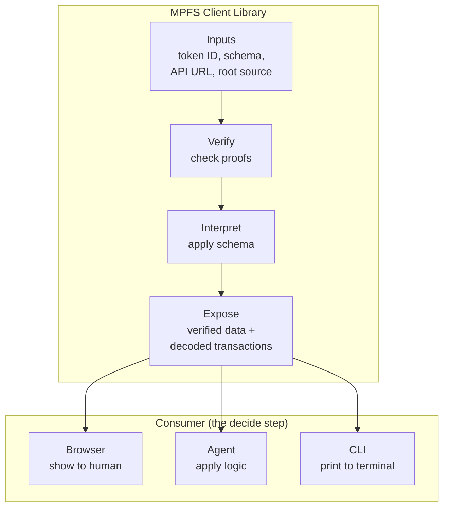

# Design

Cardano MPFS Browser is the **trusted interface** between the user
and the MPFS protocol. It is the boundary where the digital world
(cryptographic proofs, on-chain state, Merkle trees) meets the
non-digital world (a human making decisions).

Everything below this layer is verifiable: proofs are mathematical,
chain state is consensus, the MPFS service is just a data pipe.
But none of that matters if the interface that translates digital
facts into human-readable information is wrong. If this code
misrepresents a transaction, the user signs something they didn't
intend. If it misrenders a fact, the user acts on false data.

This is the trust boundary. This is Web3: not "trustless" in the
sense that trust disappears, but that trust is **relocated** —
from opaque servers to auditable client code that verifies proofs
before presenting anything to the user.

## The MPFS Application Pattern

Any application built on MPFS — whether a browser, a CLI, or an
automated agent — must follow the same pattern:

1. **Verify** — check proofs for every piece of data received
   from the untrusted service
2. **Interpret** — decode raw bytes into domain meaning using
   a verified schema
3. **Decide** — make a trust decision (sign or reject a
   transaction)

The difference between applications is only in step 3:

- A **browser** presents verified facts to a human, who decides
- An **agent** applies programmatic logic to verified facts and
  decides autonomously
- A **CLI** does the same as the browser, but in a terminal

The trust architecture is identical. The browser is the
**reference implementation** of this pattern — and the first
real MPFS client. Any domain-specific application built on MPFS
(a credential verifier, a supply chain tracker, a registry)
replicates this same structure, adding domain logic on top of
verified facts.

### MPFS Client Libraries

The verify–interpret–decide machinery is not application-specific.
It belongs in a library that any MPFS application can consume.
This repository produces two artifacts:

1. **The browser app** — the SPA, a consumer of the library
2. **The JS client library** — published to npm, usable by any
   JavaScript/TypeScript application (browser or Node.js)

The library takes the three user inputs (token ID, schema, API
URL + institutional root source) and exposes verified facts,
decoded transactions, and proof verification. The consumer
supplies the "decide" step — a human in the browser, business
logic in an agent, a prompt in a CLI.

Beyond JavaScript, we are committed to providing the same
trust machinery as native libraries for backend and systems
integration:

| Library | Language | Target |
|---------|----------|--------|
| JS/npm | PureScript → JS | Browser, Node.js |
| Native (C ABI) | Haskell or Rust | C, C++, Python, Go, any FFI |

The native library exposes the same verify–interpret–decide
interface via C-compatible FFI, enabling MPFS applications in
any language that can call C functions.

### This Application

The browser serves two purposes:

1. **Fact Explorer** — given an MPFS token, query its facts and
   render them using a verified schema, with full proof
   verification at every step
2. **MPFS Client** — interact with the cage protocol (insert,
   delete, update) and sign transactions via a CIP-30 wallet,
   with every unsigned transaction decoded and displayed in
   human-readable MPFS semantics before signing

## Documentation

- [Trust Model](trust-model.md) — verification chain, oracle, MPFS obligation
- [Schema & Views](schema-views.md) — schema discovery, view templates, lifecycle
- [Transactions](transactions.md) — tx flow, input resolution, signing
- [Architecture](architecture.md) — pages, state, wallet, API, tech stack
