# Design

## Overview

Cardano MPFS Browser is the **trusted interface** between the user
and the MPFS protocol. It is the boundary where the digital world
(cryptographic proofs, on-chain state, Merkle trees) meets the
non-digital world (a human making decisions).

Everything below this layer is verifiable: proofs are mathematical,
chain state is consensus, the MPFS service is just a data pipe.
But none of that matters if the interface that translates digital
facts into human-readable information is wrong. If this code
misrepresents a transaction, the user signs something they didn't
intend. If it misrenders a fact, the user acts on false data.

This is the trust boundary. This is Web3: not "trustless" in the
sense that trust disappears, but that trust is **relocated** —
from opaque servers to auditable client code that verifies proofs
before presenting anything to the user.

## The MPFS Application Pattern

Any application built on MPFS — whether a browser, a CLI, or an
automated agent — must follow the same pattern:

1. **Verify** — check proofs for every piece of data received
   from the untrusted service
2. **Interpret** — decode raw bytes into domain meaning using
   a verified schema
3. **Decide** — make a trust decision (sign or reject a
   transaction)

The difference between applications is only in step 3:

- A **browser** presents verified facts to a human, who decides
- An **agent** applies programmatic logic to verified facts and
  decides autonomously
- A **CLI** does the same as the browser, but in a terminal

The trust architecture is identical. The browser is the
**reference implementation** of this pattern — and the first
real MPFS client. Any domain-specific application built on MPFS
(a credential verifier, a supply chain tracker, a registry)
replicates this same structure, adding domain logic on top of
verified facts.

### MPFS Client Libraries

The verify–interpret–decide machinery is not application-specific.
It belongs in a library that any MPFS application can consume.
This repository produces two artifacts:

1. **The browser app** — the SPA, a consumer of the library
2. **The JS client library** — published to npm, usable by any
   JavaScript/TypeScript application (browser or Node.js)

The library takes the three user inputs (token ID, schema, API
URL + institutional root source) and exposes verified facts,
decoded transactions, and proof verification. The consumer
supplies the "decide" step — a human in the browser, business
logic in an agent, a prompt in a CLI.

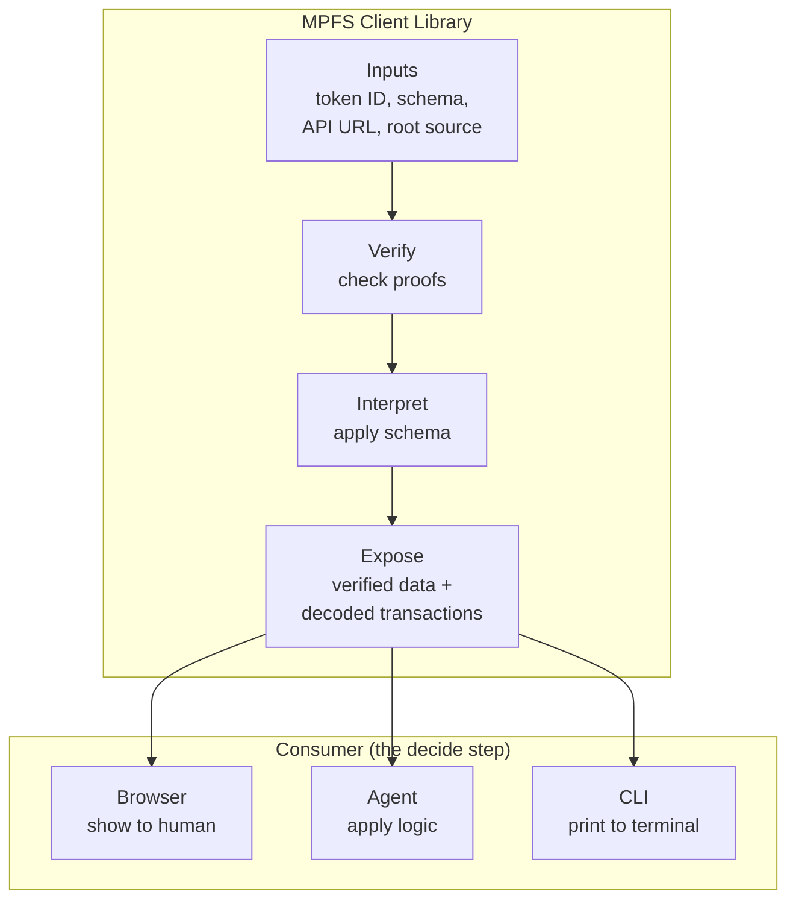

Beyond JavaScript, we are committed to providing the same
trust machinery as native libraries for backend and systems
integration:

| Library | Language | Target |
|---------|----------|--------|
| JS/npm | PureScript → JS | Browser, Node.js |
| Native (C ABI) | Haskell or Rust | C, C++, Python, Go, any FFI |

The native library exposes the same verify–interpret–decide
interface via C-compatible FFI, enabling MPFS applications in
any language that can call C functions.

### This Application

The browser serves two purposes:

1. **Fact Explorer** — given an MPFS token, query its facts and
   render them using a verified schema, with full proof
   verification at every step
2. **MPFS Client** — interact with the cage protocol (insert,
   delete, update) and sign transactions via a CIP-30 wallet,
   with every unsigned transaction decoded and displayed in
   human-readable MPFS semantics before signing

## Trust Model

### System Context

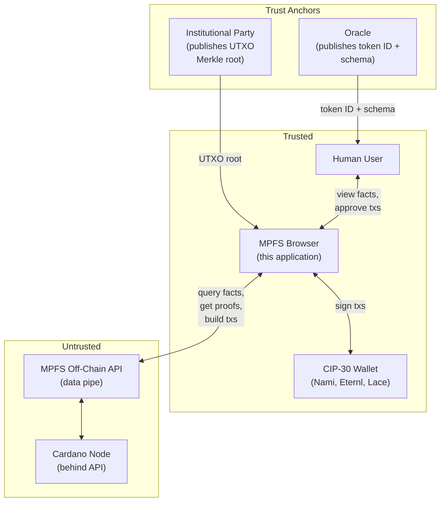

### What the User Needs

To use the application, a user provides exactly three inputs:

1. **Token ID** — published by the oracle (token owner) alongside
   the schema. The oracle is responsible for making this public.
2. **MPFS API URL** — the address of any MPFS off-chain service.
   This is **untrusted** — it is just a data pipe.
3. **Institutional UTXO Merkle root source** — a trusted party
   (e.g. Cardano Foundation) that publishes the current UTXO
   Merkle tree root.

Everything else is provable. The MPFS service is **obligated** to
provide proofs for anything it claims — if it lies or withholds
data, the proofs won't verify and the user knows immediately.

### The Oracle's Responsibility

The oracle (token owner) publishes:

- The **token ID** — identifies the cage on-chain
- The **schema** — describes how to interpret facts
- The **schema hash** is stored as a fact in the trie itself

By publishing the token ID, the oracle gives users the entry
point to independently verify everything: the cage UTxO, the
trie root, the schema hash, and every fact.

### The Verification Chain

The application verifies facts through a four-layer chain, where
each layer is independently provable:

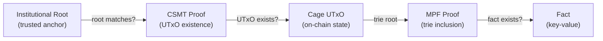

| Layer | What it proves | Trust source |
|-------|---------------|--------------|
| Institutional Root | The UTXO Merkle root is authentic | Published by a known party (e.g. Cardano Foundation) |
| CSMT Proof | The cage UTxO exists in the UTXO set | Verified against institutional root |
| Cage UTxO | The cage's current trie root | Proved to exist on-chain |
| MPF Proof | A fact exists in the cage's trie | Verified against cage's trie root |

**No Cardano node is required.** The entire chain is verified
client-side using cryptographic proofs and a single trusted root.

### What the User Trusts

- The oracle's published token ID (explicit, public)
- The institutional root publisher (explicit, auditable)
- The browser (runs the verification code)
- **Nothing else** — not the MPFS off-chain service, not the API

### The MPFS Service Obligation

The off-chain service is untrusted but has a clear contract: for
any data it holds that is committed to the Merkle tree, it
**must** provide the corresponding proof. The user can always
verify:

- Is this fact actually in the trie? (MPF proof)
- Does this trie root match what's on-chain? (cage UTxO)
- Does this cage UTxO actually exist? (CSMT proof)
- Is the UTXO set root authentic? (institutional root)

If any link breaks, the user sees it. The service cannot
selectively lie — it either provides valid proofs or the
verification fails visibly.

## Schema-Driven Fact Rendering

### The Problem

MPFS stores facts as raw bytestrings. In real applications these
will be structured data (JSON-LD, CBOR, etc.) but the trie is
format-agnostic. The frontend needs to know how to interpret
and render the bytes.

### Schema Discovery

The oracle publishes the token ID and the schema together. The
schema's hash is stored as a fact in the trie, so the trust chain
applies to the schema itself — a bogus schema would fail hash
verification.

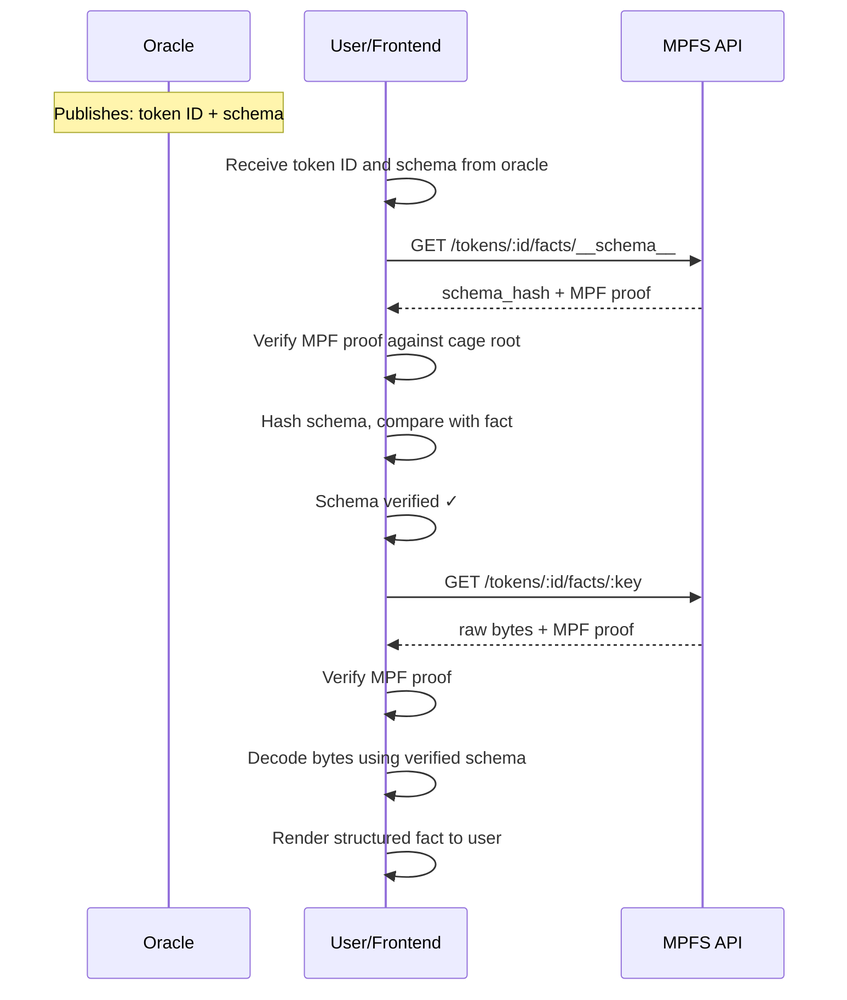

The schema is as trustworthy as any other fact in the trie. If
the oracle updates the schema, the hash fact is updated too, and
the frontend detects the change on next verification.

### Schema and View Templates

The oracle publishes two kinds of metadata, both hashed into
the trie as facts:

**Schema** — how to decode fact bytes:

- **Encoding** — JSON, CBOR, UTF-8, custom
- **Fields** — named fields with types

**View templates** — how to render decoded facts for humans:

- **Labels** — display names for fields
- **Formatting** — dates, amounts, identifiers
- **Layout** — which fields are primary, grouping, ordering

The schema and the view templates are separate concerns. The
schema is stable (changing it means changing fact encoding). View
templates evolve freely — new views can be added without touching
the schema or existing facts.

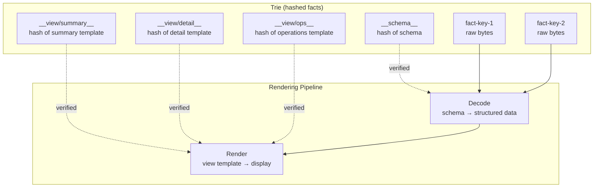

### Multiple Views

A token can have multiple view templates, each hashed as a
separate fact. Different views serve different purposes:

- A **summary view** for quick browsing
- A **detail view** for full fact inspection
- An **operations view** optimized for transaction workflows
- A **domain-specific view** for a particular application

View templates are hashed in the trie, so they are verified like
any other fact. The oracle controls which views are canonical,
but the process is open: anyone can propose a new view template
to the oracle. If accepted, the oracle inserts it as a fact — a
new way of seeing the same data, immediately available and
verified.

This enables a community-driven UX evolution: users discover
better ways to present the data, submit templates, and the oracle
curates them. Complex applications can ship multiple views for
different roles or workflows without changing the underlying
data.

### View Template Lifecycle

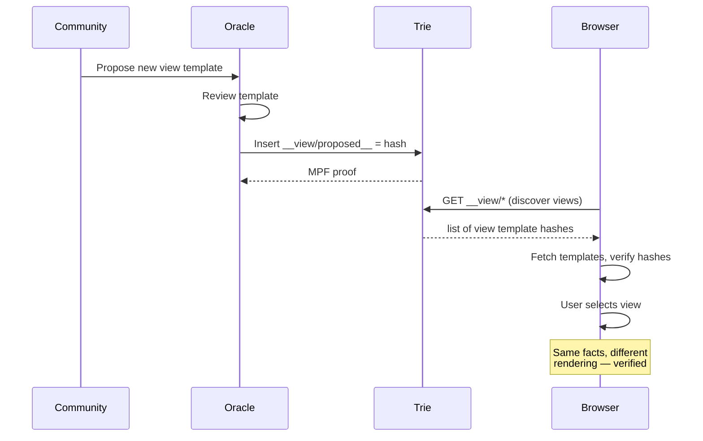

### Schema Format

The exact schema format is TBD. Candidates:

- JSON Schema with rendering extensions
- A minimal custom format (since we only need decoding + display)
- CIP-100 / JSON-LD alignment for Cardano ecosystem compatibility

## MPFS Client

### Transaction Flow

The client interacts with the cage protocol through the MPFS API.
The API builds unsigned transactions; the client decodes them,
displays their MPFS semantics in human-readable form, and
delegates signing to the user's CIP-30 wallet.

Because the API is untrusted, the client always decodes the
unsigned CBOR before requesting a signature — the user sees
exactly what they are signing.

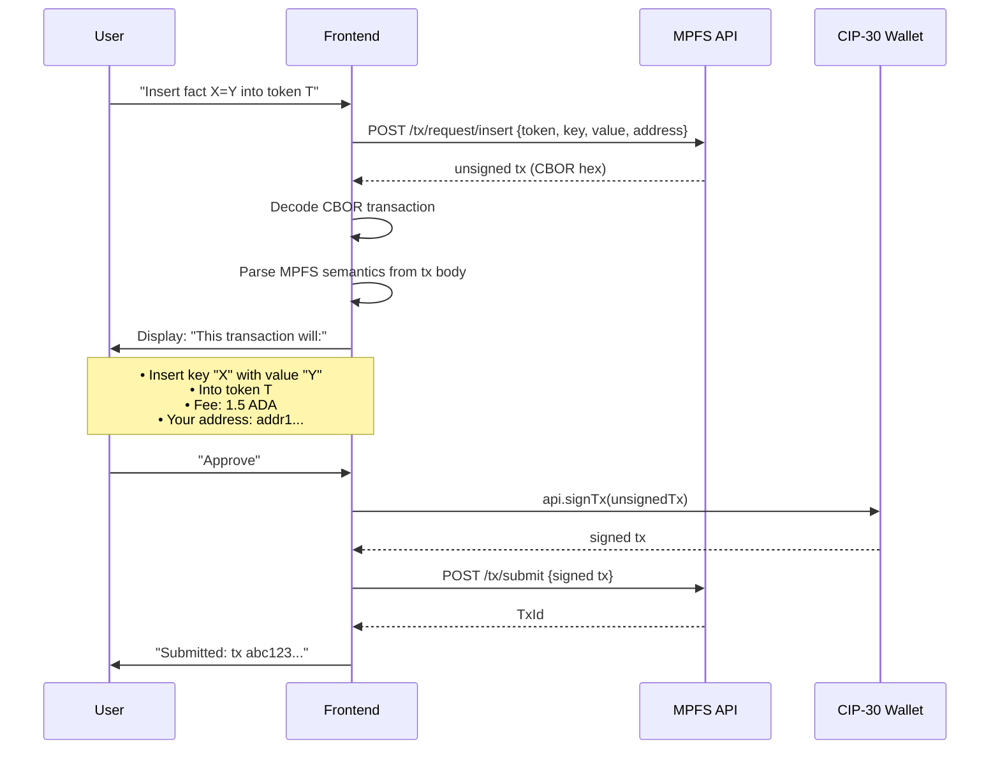

### What the Frontend Decodes

From the unsigned CBOR transaction, the frontend extracts and
displays:

| Field | Source | Display |
|-------|--------|---------|
| Operation | Redeemer (Contribute/Modify/Mint) | "Insert", "Delete", "Update", "Boot", "Retract", "End" |
| Token | Asset name in tx outputs | Token identifier |
| Key | Request datum field | Decoded via verified schema |
| Value | Request datum field | Decoded via verified schema |
| Fee | Tx fee field | ADA amount |
| Address | Tx output addresses | Bech32, highlighted if user's |
| Inputs consumed | Tx inputs | Which UTxOs are spent |

If the schema is verified, the key and value are rendered in
structured form. Otherwise they are shown as hex with a warning
that no verified schema is available.

### Transaction Signing State Machine

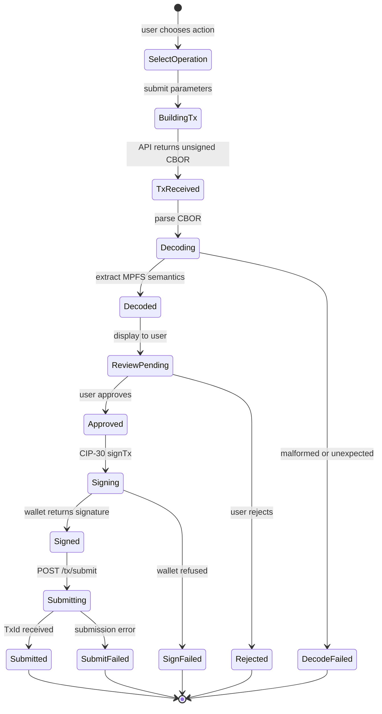

### Why the Server Doesn't Matter

The MPFS off-chain service is a convenience layer. The client
independently verifies everything:

- **Facts** — verified via the full proof chain
- **Transactions** — decoded and displayed before signing
- **State** — anchored on-chain via cage UTxOs

The server could lie, omit data, or be compromised. The client
catches it because every claim requires a cryptographic proof.
This is the key value proposition: a trusted client that works
with any untrusted server.

## CIP-30 Wallet Integration

### Connection Flow

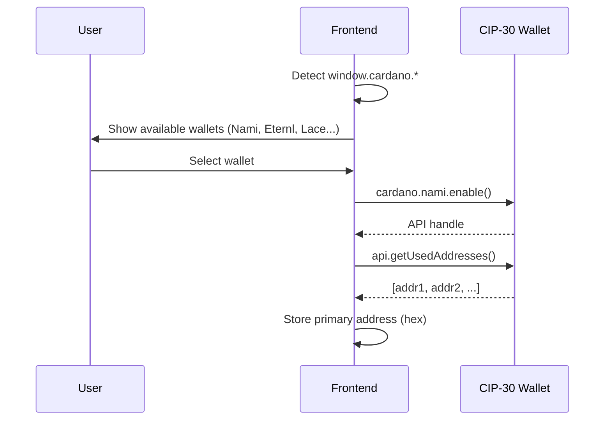

### API Surface Used

| CIP-30 Method | Purpose |
|---------------|---------|
| `cardano.<wallet>.enable()` | Connect to wallet |
| `api.getUsedAddresses()` | Get user's address for tx building |
| `api.signTx(tx, partialSign)` | Sign unsigned transaction |
| `api.getNetworkId()` | Verify correct network (mainnet/testnet) |

The frontend does **not** use `api.submitTx()` — submission goes
through the MPFS API which handles chain submission via its node
connection.

## State Persistence

The entire application state is serialized to localStorage. If the
browser tab closes — accidentally or intentionally — reopening
restores the exact same view: same token, same fact, same pending
transaction, same wallet connection.

### What Lives Where

| Storage | Content | Purpose |
|---------|---------|---------|
| URL hash | Navigation: token, fact key, current page | Bookmarkable, shareable |
| localStorage | Session config: API URL, root source, connected wallet, verified schemas, view state | Survives tab close |

### URL Structure

```
#/token/abc123                    → token detail
#/token/abc123/facts              → fact list
#/token/abc123/facts/mykey        → fact detail + proof
#/token/abc123/tx/insert          → build insert tx
```

### Recovery Guarantee

The app serializes its full state to localStorage on every state
change. On load, it reads localStorage first, then the URL hash.
The result: Ctrl+W → reopen → identical view. No re-entry of API
URL, no wallet reconnection prompt, no lost context.

This is critical for the trust boundary role: the user must
always be able to see where they are in a verification or
signing flow, even after an interruption.

## Application Structure

### Pages

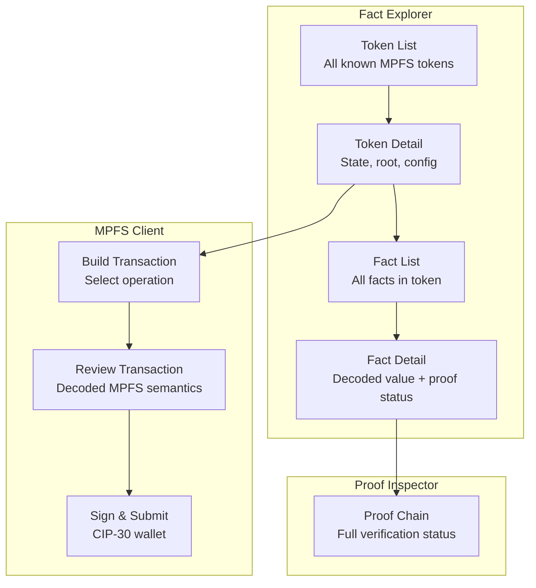

### Token List View

Shows all MPFS tokens the API tracks:

- Token ID (asset name, hex + decoded if UTF-8)
- Owner (payment key hash → bech32 if possible)
- Current root (truncated hash)
- Pending requests count
- Phase indicator (process/retract window)

### Fact Detail View

For a single fact:

- **Key** — raw hex + schema-decoded rendering
- **Value** — raw hex + schema-decoded rendering
- **Proof status**:
    - ✓ MPF proof valid against cage root
    - ✓ Cage UTxO exists (CSMT proof valid)
    - ✓ CSMT root matches institutional publisher
    - Or: ⚠ partial verification (e.g. no institutional root
      configured)

### Proof Inspector

Expandable panel showing the full verification chain:

- Institutional root source and value
- CSMT proof steps (Merkle path)
- Cage UTxO details (TxIn, datum, value)
- MPF proof steps (trie path)
- Final verdict: fully verified / partially verified / unverified

### Fact Verification State Machine

Each fact goes through a verification pipeline. The UI reflects
the current state with visual indicators:

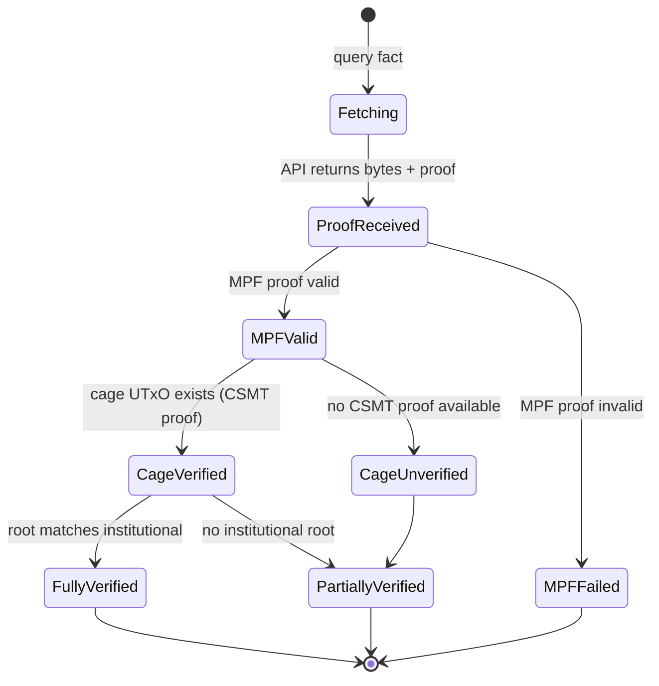

| State | UI Indicator | Meaning |
|-------|-------------|---------|
| Fetching | Spinner | Awaiting API response |
| MPF Failed | Red | Fact proof invalid — data cannot be trusted |
| Partially Verified | Yellow | Fact is in trie, but chain anchor incomplete |
| Fully Verified | Green | Complete proof chain from fact to institutional root |

## Institutional Root Sources

The application needs at least one trusted source for the UTXO
Merkle root. This is configurable:

- **URL endpoint** — the institutional party publishes the current
  root at a known URL (simplest)
- **On-chain reference** — the root is published in a datum on-chain
  (self-referential but removes the URL dependency)
- **Multiple sources** — cross-reference roots from multiple
  publishers for higher confidence

The UI shows which root source is active and when it was last
updated.

## API Dependency

The frontend consumes the MPFS off-chain HTTP API. Current endpoint
status:

### Available (PR #108)

| Endpoint | Purpose |
|----------|---------|
| `GET /status` | Service health and sync status |
| `GET /tokens` | List all tracked tokens |
| `GET /tokens/:id` | Token state (owner, root, config) |
| `GET /tokens/:id/root` | Current trie root |
| `GET /tokens/:id/facts/:key` | Fact value + MPF proof |
| `GET /tokens/:id/proofs/:key` | MPF proof only |
| `GET /tokens/:id/requests` | Pending requests |
| `POST /tx/boot` | Build boot transaction |
| `POST /tx/request/insert` | Build insert request tx |
| `POST /tx/request/delete` | Build delete request tx |
| `POST /tx/update` | Build update tx |
| `POST /tx/retract` | Build retract tx |
| `POST /tx/end` | Build end tx |
| `POST /tx/submit` | Submit signed tx |

### Needed (issue #117)

| Endpoint | Purpose |
|----------|---------|
| `GET /utxo/:txin` | Resolve TxIn to full UTxO |
| `GET /utxo/:txin/proof` | CSMT inclusion proof |
| `GET /csmt/root` | Current UTXO Merkle root |

## Technology Stack

- **PureScript** with Halogen (component framework)
- **Nix flake** for reproducible dev environment
- **esbuild** for bundling (via spago)
- **MkDocs** with Material theme for documentation
- **No backend** — static SPA served from GitHub Pages or
  alongside the MPFS API

## Open Questions

1. **Schema format** — JSON Schema + extensions? Custom minimal
   format? CIP-100 alignment?
2. **CBOR decoding in PureScript** — which library? FFI to a JS
   CBOR library? How much of the Cardano tx structure do we need
   to parse?
3. **Institutional root protocol** — is there a standard for
   publishing UTXO Merkle roots, or do we define one?
4. **Multi-token view** — should the explorer support comparing
   facts across tokens, or is it strictly per-token?
5. **Schema registry** — could schemas themselves be an MPFS token,
   creating a self-referential schema registry?
