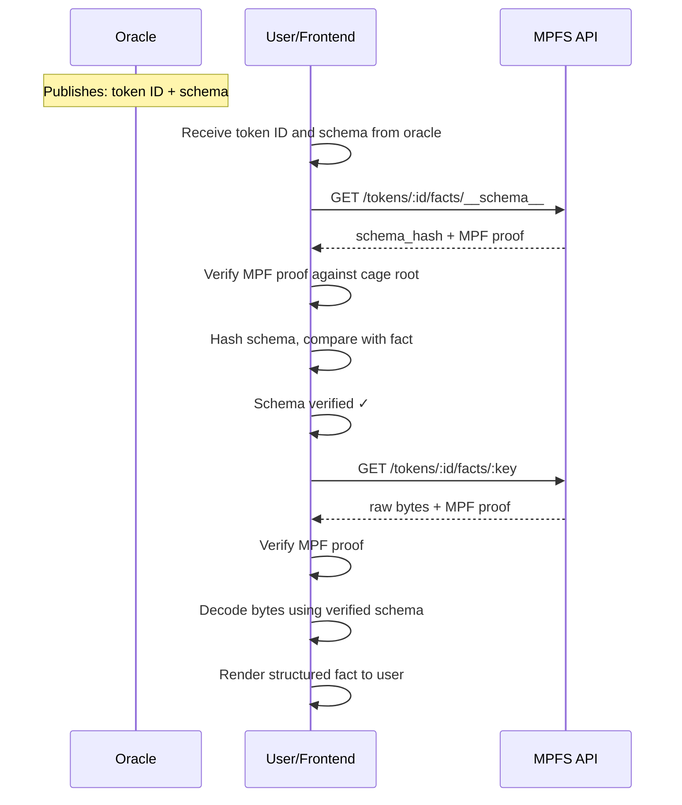
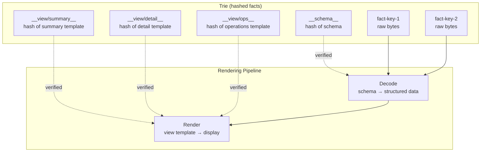
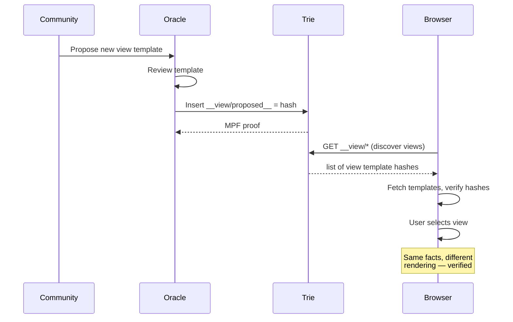

# Schema & View Templates

## The Problem

MPFS stores facts as raw bytestrings. In real applications these
will be structured data (JSON-LD, CBOR, etc.) but the trie is
format-agnostic. The frontend needs to know how to interpret
and render the bytes.

## Schema Discovery

The oracle publishes the token ID and the schema together. The
schema's hash is stored as a fact in the trie, so the trust chain
applies to the schema itself — a bogus schema would fail hash
verification.

The schema is as trustworthy as any other fact in the trie. If
the oracle updates the schema, the hash fact is updated too, and
the frontend detects the change on next verification.

## Schema and View Templates

The oracle publishes two kinds of metadata, both hashed into
the trie as facts:

**Schema** — how to decode fact bytes:

- **Encoding** — JSON, CBOR, UTF-8, custom
- **Fields** — named fields with types

**View templates** — how to render decoded facts for humans:

- **Labels** — display names for fields
- **Formatting** — dates, amounts, identifiers
- **Layout** — which fields are primary, grouping, ordering

The schema and the view templates are separate concerns. The
schema is stable (changing it means changing fact encoding). View
templates evolve freely — new views can be added without touching
the schema or existing facts.

## Multiple Views

A token can have multiple view templates, each hashed as a
separate fact. Different views serve different purposes:

- A **summary view** for quick browsing
- A **detail view** for full fact inspection
- An **operations view** optimized for transaction workflows
- A **domain-specific view** for a particular application

View templates are hashed in the trie, so they are verified like
any other fact. The oracle controls which views are canonical,
but the process is open: anyone can propose a new view template
to the oracle. If accepted, the oracle inserts it as a fact — a
new way of seeing the same data, immediately available and
verified.

This enables a community-driven UX evolution: users discover
better ways to present the data, submit templates, and the oracle
curates them. Complex applications can ship multiple views for
different roles or workflows without changing the underlying
data.

## View Template Lifecycle

## Schema Format

The exact schema format is TBD. Candidates:

- JSON Schema with rendering extensions
- A minimal custom format (since we only need decoding + display)
- CIP-100 / JSON-LD alignment for Cardano ecosystem compatibility
