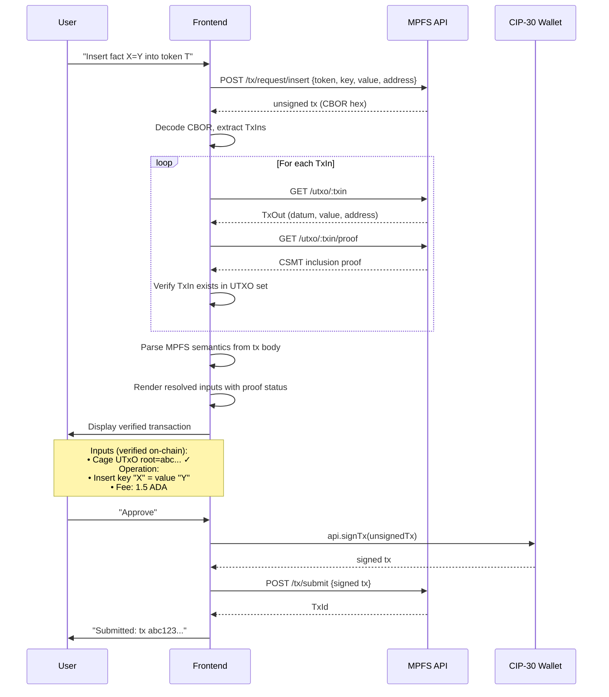
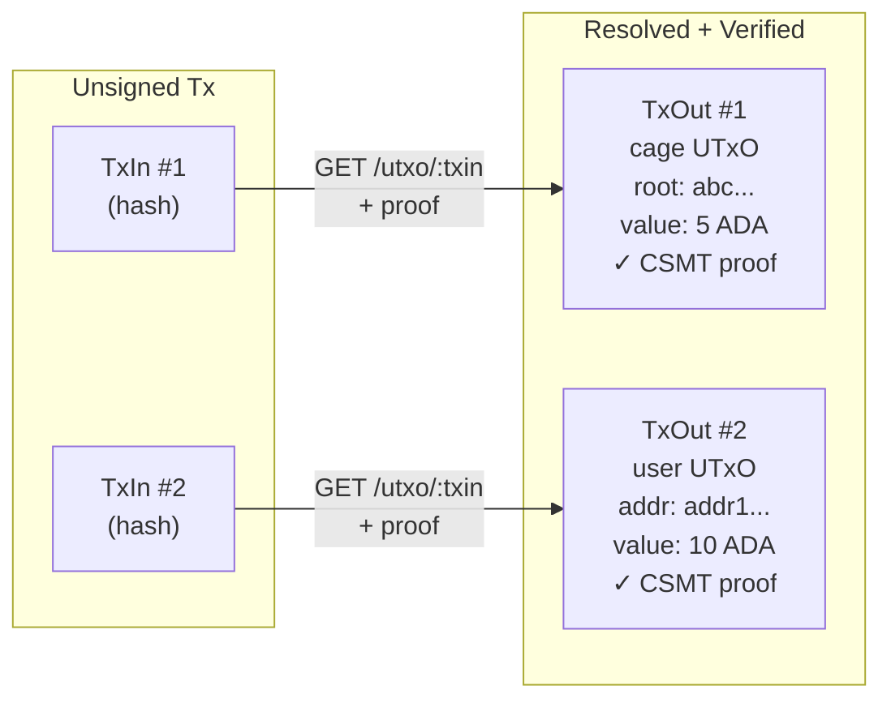
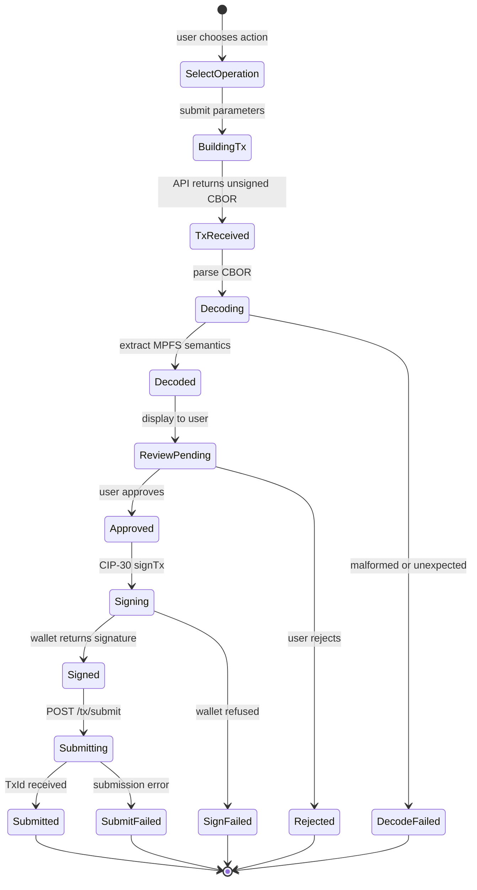

# Transactions

## Transaction Flow

The client interacts with the cage protocol through the MPFS API.
The API builds unsigned transactions; the client decodes them,
displays their MPFS semantics in human-readable form, and
delegates signing to the user's CIP-30 wallet.

Because the API is untrusted, the client always decodes the
unsigned CBOR before requesting a signature — the user sees
exactly what they are signing.

## Input Resolution and Verification

The unsigned transaction contains TxIns — references to UTxOs
being spent. Raw TxIns are opaque hashes. The client **resolves**
each TxIn to its full TxOut content and **verifies** it exists
in the UTXO set via a CSMT proof.

This is critical: without resolving and verifying inputs, the
user cannot know what the transaction actually spends. The API
could claim a TxIn points to one UTxO while the transaction
actually consumes another. The CSMT proof makes this impossible
— each input is independently proven to exist in the UTXO set.

## What the Frontend Displays

From the decoded transaction and resolved inputs, the frontend
presents:

| Field | Source | Display |
|-------|--------|---------|
| **Inputs** | TxIns, resolved via API | Full TxOut content with CSMT proof status |
| Cage UTxO | Input datum | Trie root, owner, config — verified on-chain |
| Operation | Redeemer (Contribute/Modify/Mint) | "Insert", "Delete", "Update", "Boot", "Retract", "End" |
| Token | Asset name in tx outputs | Token identifier |
| Key | Request datum field | Decoded via verified schema |
| Value | Request datum field | Decoded via verified schema |
| Fee | Tx fee field | ADA amount |
| Address | Tx output addresses | Bech32, highlighted if user's |

If the schema is verified, the key and value are rendered in
structured form. Otherwise they are shown as hex with a warning
that no verified schema is available.

Every input carries a proof indicator. If any input cannot be
verified, the UI warns prominently — the user should not sign
a transaction with unverified inputs.

## Transaction Signing State Machine

## Why the Server Doesn't Matter

The MPFS off-chain service is a convenience layer. The client
independently verifies everything:

- **Facts** — verified via the full proof chain
- **Transactions** — decoded and displayed before signing
- **State** — anchored on-chain via cage UTxOs

The server could lie, omit data, or be compromised. The client
catches it because every claim requires a cryptographic proof.
This is the key value proposition: a trusted client that works
with any untrusted server.
