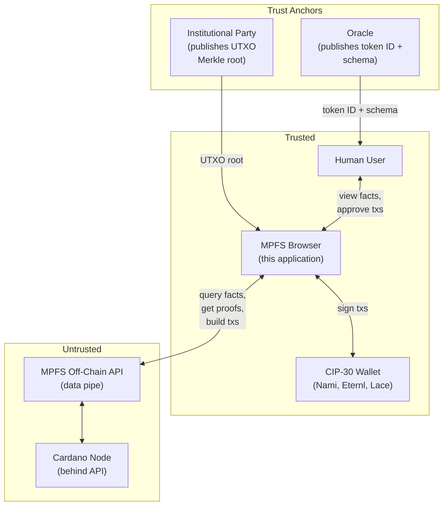
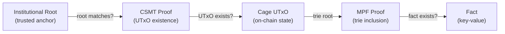

# Trust Model

## System Context

## What the User Needs

To use the application, a user provides exactly three inputs:

1. **Token ID** — published by the oracle (token owner) alongside
   the schema. The oracle is responsible for making this public.
2. **MPFS API URL** — the address of any MPFS off-chain service.
   This is **untrusted** — it is just a data pipe.
3. **Institutional UTXO Merkle root source** — a trusted party
   (e.g. Cardano Foundation) that publishes the current UTXO
   Merkle tree root.

Everything else is provable. The MPFS service is **obligated** to
provide proofs for anything it claims — if it lies or withholds
data, the proofs won't verify and the user knows immediately.

## The Oracle's Responsibility

The oracle (token owner) publishes:

- The **token ID** — identifies the cage on-chain
- The **schema** — describes how to interpret facts
- The **schema hash** is stored as a fact in the trie itself

By publishing the token ID, the oracle gives users the entry
point to independently verify everything: the cage UTxO, the
trie root, the schema hash, and every fact.

## The Verification Chain

The application verifies facts through a four-layer chain, where
each layer is independently provable:

| Layer | What it proves | Trust source |
|-------|---------------|--------------|
| Institutional Root | The UTXO Merkle root is authentic | Published by a known party (e.g. Cardano Foundation) |
| CSMT Proof | The cage UTxO exists in the UTXO set | Verified against institutional root |
| Cage UTxO | The cage's current trie root | Proved to exist on-chain |
| MPF Proof | A fact exists in the cage's trie | Verified against cage's trie root |

**No Cardano node is required.** The entire chain is verified
client-side using cryptographic proofs and a single trusted root.

## What the User Trusts

- The oracle's published token ID (explicit, public)
- The institutional root publisher (explicit, auditable)
- The browser (runs the verification code)
- **Nothing else** — not the MPFS off-chain service, not the API

## The MPFS Service Obligation

The off-chain service is untrusted but has a clear contract: for
any data it holds that is committed to the Merkle tree, it
**must** provide the corresponding proof. The user can always
verify:

- Is this fact actually in the trie? (MPF proof)
- Does this trie root match what's on-chain? (cage UTxO)
- Does this cage UTxO actually exist? (CSMT proof)
- Is the UTXO set root authentic? (institutional root)

If any link breaks, the user sees it. The service cannot
selectively lie — it either provides valid proofs or the
verification fails visibly.

## Institutional Root Sources

The application needs at least one trusted source for the UTXO
Merkle root. This is configurable:

- **URL endpoint** — the institutional party publishes the current
  root at a known URL (simplest)
- **On-chain reference** — the root is published in a datum on-chain
  (self-referential but removes the URL dependency)
- **Multiple sources** — cross-reference roots from multiple
  publishers for higher confidence

The UI shows which root source is active and when it was last
updated.
